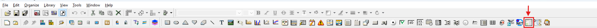

<!-- --8<-- [start:body] -->

# Kartor och indikatorer — Kom igång
???+ info "Krav"
    Följande skript krävs för att använda Kartor och indikatorer samt all
    relaterad funktionalitet som beskrivs i guiderna för Kartor och indikatorer:
    
    * `scMap`
    * `scMaintenance`
    * `scDatabase`
    * `scThemes`
    * `scAlert`
    
    Samt följande objektbibliotek:
    
    * `Map Indicators`
    * `WEATHER`

Det här avsnittet beskriver hur du konfigurerar ett **Map View**-objekt i WideQuick och hur du lägger till
grundläggande indikatorer. För konfigurering av mer avancerade indikatorer, såsom Pin Status, Cluster
Pins och Lines, se [Kartor och indikatorer — Konfigurera](configuring.md). För att koppla
ett **Alarm**-objekt till en **Map View** och skapa anpassade indikatorer, se
[Kartor och indikatorer — Utöka](extending.md).


## Konfigurera ett Map View-objekt { #setting-up-a-map-view-object }

För att använda Map Indicators krävs ett **Map View**-objekt. Det finns i
Objects Toolbar i **WideQuick Designer®**:



Placera det i den vy där du vill visa din karta.

När det är placerat behöver **Map View**-objektet länkas till skriptet `scMap`. Gör detta
genom att lägga till följande onLoad-skript på **Map View**-objektet:

```javascript title="Map View — onLoad"
scMap.mapView = this;
scMap.initClusters(this);
if (scMap.alarmList) scMap.updateAlarmList(this, scMap.alarmList);
```

Alla objekt inuti en **Map View** har en egenskap kallad `geo`, som innehåller objektets
geografiska koordinater. För att indikatorerna ska renderas korrekt
när användaren panorerar och zoomar behöver **Map View** spåra skalan och det synliga
området i den aktuella visningsrutan. Detta görs genom att lägga till följande skript i
synlighetsdynamiken för **Map View**:

```javascript title="Map View — visibility dynamics"
mapRatioWidth = this.width * scWM.scalingFactor / this.visibleRect().width
mapRatioHeight = this.height * scWM.scalingFactor / this.visibleRect().height
weatherLat = this.latitude
weatherLon = this.longitude

var web = false;
var sysInfo = app.System.info()
if (sysInfo.productId == sysInfo.WQWeb) {
    web = true;
}

if (web && (app.subNavMenu.visible || app._subNavRemoteVisible)) {
    this.width = 1300
} else {
    this.width = 1620;
}

return true;
```

Du är nu redo att lägga till Map Indicators.

## Lägga till grundläggande indikatorer { #adding-basic-indicators }
Map Indicators finns i objektbiblioteket **Map Indicators** i **WideQuick
Designer®**. För att lägga till en indikator, dra den från objektbiblioteket och släpp den i
**Map View**-objektet. De flesta indikatorer kräver att longitud och latitud anges,
vilket bestämmer var de visas på kartan.


Följande avsnitt beskriver varje grundläggande indikator och eventuell konfigurering som krävs.

### Zoomknapp { #zoom-button }
Att lägga till en zoomknapp är enkelt — den har inga egenskaper att konfigurera. Lägg till den
på samma sätt som vilket annat objekt som helst i en **Map View**. Om du är osäker på hur du gör detta,
se WideQuick-hjälpen genom att trycka på F1 i **WideQuick Designer®**.

Zoomknappen placerar sig automatiskt i nedre högra hörnet av
**Map View** och kräver ingen longitud- eller latitudinmatning.

### Pins { #pins }
Pins lämpar sig väl för att markera platser av intresse, till exempel en anläggning eller ett system som
övervakas eller styrs. Lägg till en pin på samma sätt som vilket annat objekt som helst i en **Map View**,
och tilldela den longitud och latitud för platsen.

För att göra pinnen klickbar och länka den till en relaterad **arbetsvy**, redigera
egenskapen **linkedView**:


Värdet ska vara en sökväg till en **arbetsvy** i mappen **Main_Menu** eller **System**.
I exemplet ovan pekar den på processvyn **arbetsvy** **Inlopp**,
som finns på `System/Videdal/Inlopp.kvie`.

### Väder-widget { #weather-widget }
Väder-widgeten visar väderinformation för en given koordinat genom att anropa
SMHI:s väder-API. Som standard hämtas koordinaterna från mitten av
**Map View**-objektet med hjälp av de interna variablerna `weatherLon` och `weatherLat`, vilka
sätts i synlighetsdynamikskriptet som beskrivs
[ovan](#setting-up-a-map-view-object).

Widgeten behöver också pekas mot sin datakälla, som är DataStore-variabeln `weather` som standard. Detta konfigureras på fliken Properties i
**Map View**:


När widgeten är konfigurerad visar den aktuell väderinformation för
mitten av det synliga kartområdet och uppdateras automatiskt när användaren navigerar på kartan.

## Nästa steg { #next-steps }

* [Konfigurera](configuring.md) — pin-statusindikatorer, klusterpins, linjer och larmintegration
* [Utöka](extending.md) — skapa anpassade kartindikatorer
<!-- --8<-- [end:body] -->
