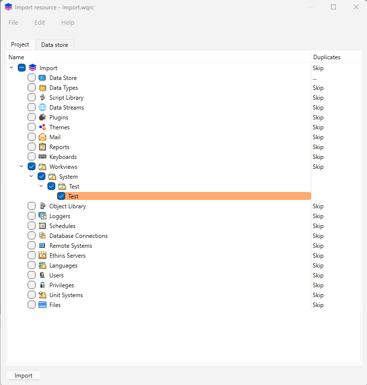

<!-- --8<-- [start:body] -->

# Resurser
WideQuick har ett inbyggt gränssnitt för att exportera och importera resurser. Detta gör det möjligt för användaren att enkelt överföra delar från ett projekt till ett annat och undvika felaktig implementation av resurser.  

## Exportera resurser { #exporting-resources }
För att exportera resurser från WideQuick på rätt sätt, tryck på följande knapp som finns i verktygsfältet

Detta öppnar följande fönster

Härifrån klickar du på ++"File"++ och väljer ny, eller använder kortkommandot "ctrl + n". Detta gör att användaren kan skapa sin .wqrc-fil med de resurser som ska exporteras. Välj ett lämpligt namn och var filen ska sparas. När detta är gjort öppnas följande fönster

Vänster sida representerar resurserna i det aktuella projektet medan höger sida är exportfilen. Välj de filer i projektet som ska exporteras. När filerna är valda, tryck på ++"Add to resources"++ — detta skapar en kopia av filerna i exportfilen, och de kopierade filerna markeras på exportsidan. När alla filer som ska exporteras har kopierats till exportsidan, tryck på ++"File"++ och ++"Save"++. Nu har exportfilen sparats och är redo att importeras till ett nytt projekt. 

### Exportera mer till en befintlig export { #exporting-more-to-a-existing-export }
Om användaren redan har en befintlig exportfil och vill lägga till fler resurser i den filen. Följ bara [Exportera resurser](#exporting-resources) men tryck på ++"Open"++ istället för att skapa en ny exportfil och välj den befintliga exportfilen. 

## Importera resurser { #importing-resources }
Att importera resurser i WideQuick är enkelt och följer samma process som vid export. Klicka på knappen "Resource" i verktygsfältet.

Detta öppnar följande fönster

Härifrån trycker du på ++"Files"++ och väljer ++"Import from.."++ — detta öppnar filutforskaren. Välj den .wqrc-fil som innehåller importerna och tryck på öppna. Detta öppnar följande fönster

I detta fönster visas alla filer i .wqrc-filen. Som standard är alla filer markerade. Om filerna redan finns eller har samma namn, visar beskrivningen under "Duplicates" texten "Skip". Genom att klicka på "Skip" kan användaren ändra det till "Duplicate" eller "Replace" — dessa alternativ växlar genom upprepade klick. När önskade filer är valda och deras "Duplicates"-status är korrekt, tryck på ++"Import"++ för att importera filerna. Detta öppnar ett fönster med resultatet, som innehåller tre beskrivningar.

* Resource - Den specifika resursen som importerades
* Status - Visar om den hoppades över, duplicerades eller ersattes
* Message - Anger om ett fel inträffade. Ett tomt meddelande betyder inget fel

Nu har filerna importerats till projektet. 

