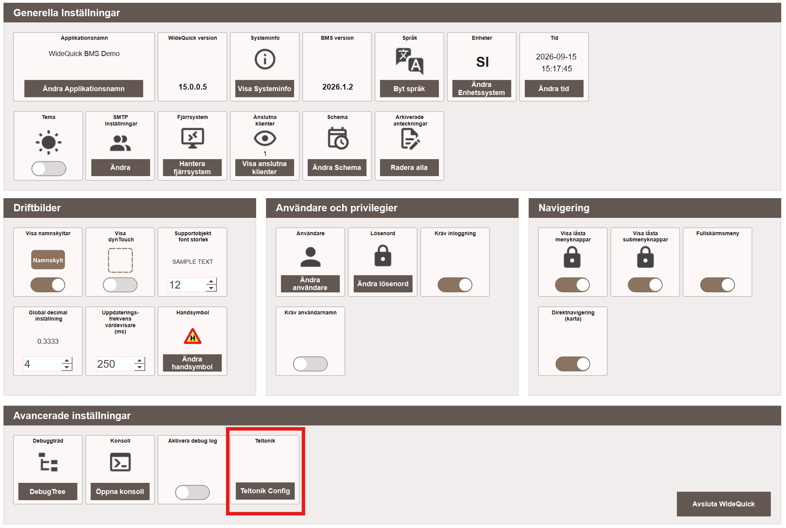
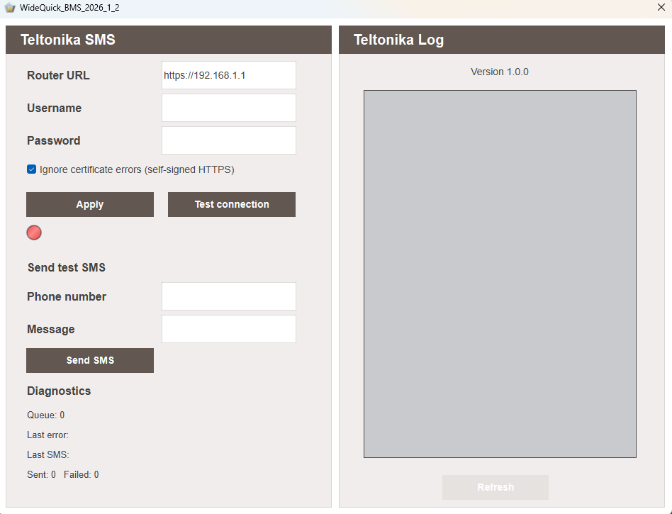

# Skicka SMS med Teltonika – Användning

Pluginet fungerar nästan som en direkt ersättning för WideQuicks inbyggda GSM-modem-system och kräver ingen skriptning. När det har [importerats som en resurs](installation.md#importera-plugin) konfigureras det helt och hållet från vyn Inställningar.

## Konfigurera pluginet

1. Starta **WideQuick® Runtime** i det projekt där pluginet importerades.
2. Navigera till **Inställningar**.
3. Under **Avancerade inställningar**, klicka på **Teltonik Config**.

    {align=center}

    Detta öppnar konfigurationsdialogen **Teltonika SMS**.

    {align=center}

4. Ange samma **Router URL**, **Username** och **Password** som användes när [användaren skapades på routern](installation.md#skapa-en-anvandare) under installationen.
5. Klicka på **Apply** för att spara konfigurationen.
6. Klicka på **Test connection** för att verifiera att anslutningen fungerar. Indikatorn blir grön så snart WideQuick lyckas ansluta till routern.

!!! note "Ignorera certifikatfel"
    **Ignore certificate errors (self-signed HTTPS)** är aktiverat som standard, eftersom routerns inbyggda certifikat är självsignerat och inte utfärdat för dess lokala IP-adress. Se [Certifikat giltigt för routerns IP-adress](avancerat.md#certifikat-giltigt-for-routerns-ip-adress) under Avancerat om du hellre vill slippa stänga av certifikatvalideringen.

## Skicka ett test-SMS

När anslutningen fungerar, använd **Send test SMS** för att verifiera att sändningen fungerar hela vägen:

1. Ange ett **Phone number** och ett **Message**.
2. Klicka på **Send SMS**.

**Diagnostics** visar aktuell kölängd, senaste felet (om något), senaste skickade SMS, samt löpande summor för skickade och misslyckade meddelanden.

## Teltonika Log

Panelen **Teltonika Log** listar varje meddelande som skickats via pluginet, tillsammans med eventuella fel, vilket gör det möjligt att följa upp sändningar och felsöka misslyckade sändningar. Klicka på **Refresh** för att uppdatera loggen.

## Automatisk sändning från larm

När pluginet är konfigurerat skickar det automatiskt SMS för alla [larmnotifieringsscheman](../../mod/modules/Core/alarms/configuring.md#alarm-notification-schedules) som redan är konfigurerade att avisera via SMS – ingen ytterligare konfiguration krävs.

!!! note "Aktivera kompakt läge"
    Det rekommenderas att aktivera kompakt läge (compact mode) för SMS i schemakonfigurationen. Detta håller meddelandena korta istället för att skicka den fullständiga, detaljerade larmtexten.
