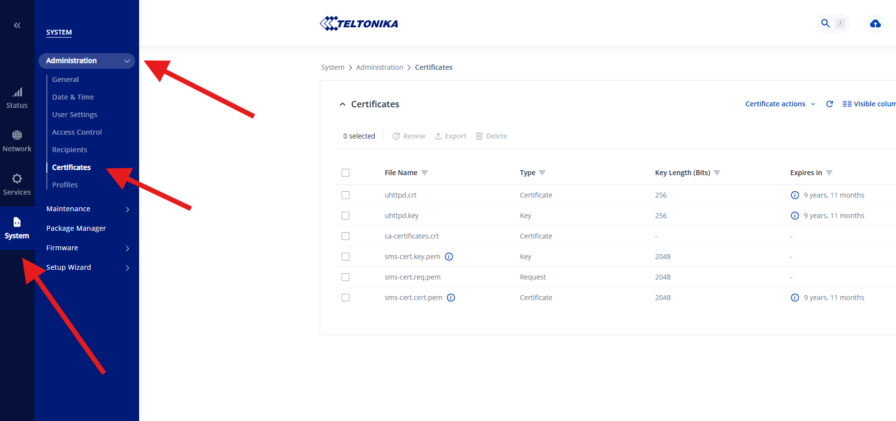
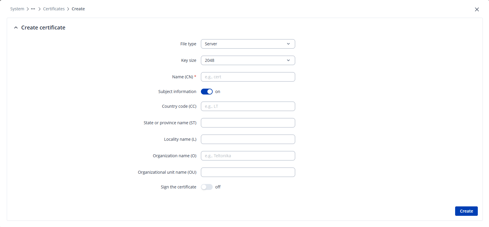
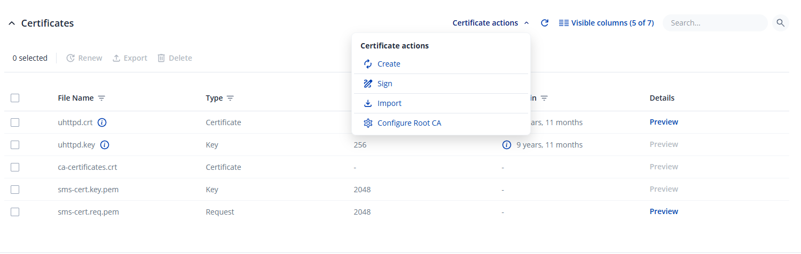
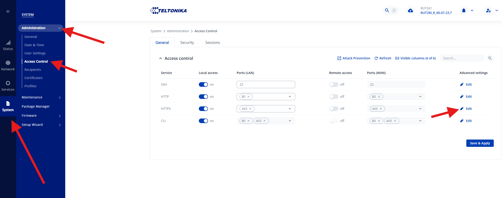

# Skicka SMS med Teltonika – Avancerat

## Certifikat giltigt för routerns IP-adress

Som ett alternativ till `SetIgnoreCertificateErrors(true)` (se [Användning](anvandning.md)) går det att skapa ett certifikat som routern faktiskt litar på för sin IP-adress, och sedan lita på det certifikatet på serverdatorn som kör WideQuick. Då slipper man stänga av certifikatvalideringen helt.

En publik certifikatutfärdare (CA), som Let's Encrypt, utfärdar aldrig certifikat för privata IP-adresser (RFC 1918, t.ex. `192.168.1.1`). Teltonika-routern har däremot en egen inbyggd CA (`uhttpd.crt` / `uhttpd.key` – samma CA som routerns eget webbgränssnitt är signerat med) som kan signera ett certifikat där IP-adressen ingår som Subject Alternative Name (SAN). Certifikatet skapas i två steg: först genereras en certifikatförfrågan (CSR), som sedan signeras separat med routerns IP-adress angiven som SAN.

### 1. Skapa en certifikatförfrågan (CSR)

1. Gå till **Certificates** i routerns admin-gränssnitt (**System → Administration → Certificates**) och klicka på **Create**.

    

2. Fyll i formuläret enligt nedan:

    

    | Fält | Värde |
    |------|-------|
    | File type | `Server` |
    | Key size | `2048` (standard räcker) |
    | Name (CN) | Valfritt, beskrivande namn – t.ex. routerns IP-adress eller `sms-cert`. Används bara för att identifiera certifikatet i listan; den faktiska adressvalideringen sker via SAN i nästa steg. |
    | Subject information (CC/ST/L/O/OU) | Valfritt. Rena metadatafält utan funktionell betydelse – kan lämnas tomma eller fyllas i, t.ex. Organization = `Kentima`. |
    | Sign the certificate | **Av** – certifikatet signeras separat i nästa steg, där SAN-fältet för IP-adresser finns. |

3. Klicka på **Create**. Det skapar en privat nyckel och en certifikatförfrågan, utan att signera den.

### 2. Signera förfrågan med routerns IP-adress som SAN

1. Hitta den nyss skapade förfrågan i listan över certifikat. Namnet från **Name (CN)** ger upphov till två poster: en privat nyckel (`<namn>.key.pem`) och en förfrågan av typen **Request** (`<namn>.req.pem`).

    

2. Markera förfrågan (typ `Request`) och öppna **Certificate actions → Sign**:

    

    | Fält | Värde |
    |------|-------|
    | Signed certificate name | Namn på det färdigsignerade certifikatet, t.ex. `sms-cert`. |
    | Type of certificate to sign | `Server` (samma typ som valdes vid skapandet av förfrågan). |
    | Certificate request file | Förfrågan av typen `Request`, t.ex. `sms-cert.req.pem`. |
    | Days valid | Giltighetstid i dagar, t.ex. `3650` för 10 år. |
    | Certificate authority file / key | `uhttpd.crt` / `uhttpd.key` – routerns inbyggda, förinstallerade CA. Kan lämnas som standard. |
    | Delete signing request | **Av** – annars går förfrågan inte att signera om senare, t.ex. för att lägga till fler SAN-poster. |
    | Hosts | Eventuella hostnamn/domännamn som ska ingå som SAN – lämnas tomt om anslutningen sker via IP-adress. |
    | IP addresses | Skriv in routerns IP-adress (t.ex. `192.168.1.1`) och lägg till den – adressen visas då som en tagg i fältet. Detta lägger till adressen som Subject Alternative Name (SAN). |

3. Klicka på **Sign**.
4. Gå till **System → Administration → Access Control** och klicka på **Edit** på raden för **HTTPS** (samma inställning nås även via **System → General → HTTPS configuration**):

    

5. Byt **Server certificate** / **Server key** till det nysignerade certifikatet och dess nyckel (`sms-cert.cert.pem` / `sms-cert.key.pem`). Klicka på **Save & Apply**.

    

### 3. Lita på certifikatet i serverdatorn

Det är routerns signerade certifikat (`sms-cert`) som skickas till klienten vid TLS-anslutningen, och som innehåller SAN med IP-adressen. Men för att Windows-datorn som kör WideQuick Server ska lita på det certifikatet måste det gå att verifiera vem som utfärdat det – därför är det CA:t (routerns egen utfärdare), inte det signerade certifikatet, som ska importeras. Genom att lita på utfärdaren litar Windows automatiskt på allt den CA:n signerar, både nu och vid en framtida förnyelse (t.ex. om routerns IP-adress ändras och certifikatet behöver signeras om) – utan att importen behöver göras om varje gång.

1. Exportera CA-certifikatet `uhttpd.crt` (enbart CA-certifikatet, inte routerns signerade certifikat eller privata nycklar) från Certificates-sidan.
2. Importera CA-certifikatet till **Trusted Root Certification Authorities** ("Betrodda certifikatsutgivare" på svenska) på Windows-datorn som kör WideQuick Server, antingen via `certmgr.msc` eller med PowerShell:

    ```powershell
    Import-Certificate -FilePath "ca.crt" -CertStoreLocation Cert:\LocalMachine\Root
    ```

Efter detta litar Windows/.NET på certifikatet – både förtroendekedjan (via den importerade CA:n) och adressmatchningen (via IP-adressen i SAN) stämmer, och `SetIgnoreCertificateErrors(true)` behövs då inte längre i skriptet.

!!! note "Värt att tänka på"
    Om routerns IP-adress ändras måste certifikatet skapas om med den nya adressen som SAN. Med flera routrar är det enklare att sätta upp en egen CA och signera samtliga routrars certifikat med den, så att bara en CA behöver litas på istället för en per enhet.

## Funktionsreferens

Utöver funktionerna som redan används i [Användning](anvandning.md) innehåller pluginet ett antal funktioner för diagnostik och drift. Pluginet kommunicerar med routern via en inbyggd REST-klient, men den behöver man normalt inte bry sig om – SMS-funktionerna nedan täcker de flesta behov.

| Funktion | Vad den gör |
|---|---|
| `PluginInfo.Version()` | Returnerar pluginets version, t.ex. `"1.0.0"` – bra sanity check direkt efter driftsättning eller uppgradering. |
| `SmsClient.GetQueueLength()` | Antal SMS som just nu väntar i bakgrundskön. |
| `SmsClient.GetLastSmsStatus()` | Resultatet av det senast avslutade utskicket, t.ex. `"OK 2026-07-03 12:01:44 +46701234567"` eller `"FAILED 2026-07-03 12:01:44 +46701234567: <orsak>"`. Tom sträng innan första utskicket är klart. |
| `SmsClient.GetSentCount()` / `GetFailedCount()` | Räknare sedan tjänsten senast startades. Går att polla för att upptäcka ett lyckat eller misslyckat utskick som ett "event" (jämför värdet mellan varje körning), eller för att övervaka ett dött modem eller felaktiga inloggningsuppgifter i drift. |
| `SmsClient.GetLog()` / `GetLog(maxRader)` | De senaste loggraderna (standard 50, buffert på max 200 rader) – lämpligt att visa i en diagnostikvy. |
| `SmsClient.ClearLog()` | Rensar minnesloggen. |
| `SmsClient.SetLogFile(sökväg)` | Speglar loggen till en fil så att historiken överlever en omstart av tjänsten (minnesloggen gör det inte). Tom sträng (`""`) stänger av filloggningen igen. |
| `RestClient.SetTimeoutSeconds(n)` | HTTP-timeout i sekunder, standard `10`. Påverkar även hur länge `SendSmsWait()` kan blockera i värsta fall (cirka 8 × timeout, ~80 s med standardvärdet) om ett köat utskick samtidigt håller på med ett omförsök. |

## Felsökning

| Symptom | Gör så här |
|---|---|
| SMS kommer aldrig fram | Kontrollera `GetLastSmsStatus()` och `GetLastError()` – de innehåller routerns felorsak (t.ex. misslyckad inloggning eller onåbar router). |
| Behöver historik över vad som hänt | `GetLog(200)` visar de senaste 200 pluginhändelserna: konfiguration, utskick, omförsök och kasserade meddelanden. |
| Behöver historik som överlever en omstart | Anropa `SetLogFile("C:\\Logs\\sms.log")` en gång vid uppstart, läs sedan filen. |
| Felet "not configured" | `Configure()` har inte körts i den här processen – kontrollera att skriptbiblioteket med konfigurationen faktiskt laddas. |
| Inget fungerar efter driftsättning eller uppgradering | Kör `PluginInfo.Version()` från ett skript. Misslyckas anropet är DLL:en inte laddad – kontrollera `ScriptPluginAssemblies` och att tjänsten startats om (se [Importera plugin](installation.md#importera-plugin)), samt att inga gamla DLL-filer ligger kvar. |
| `HTTP 401`, eller en loggrad som börjar `router redirected http:// to https://` | Routern kräver https – kontrollera att `url` i `Configure(...)` börjar med `https://`, samt att **Redirect to HTTPS** är aktiverat under **System → Administration → Access Control → HTTPS** om du är osäker. |
| `"Modem 'X' not found on this router"` | Det angivna modem-id:t i `Configure(...)` finns inte på routern. `GetLastError()` listar routerns riktiga modem-id:n – rätta argumentet, eller använd tre-argumentsvarianten av `Configure()` för att låta pluginet auto-detektera modemet istället. |
