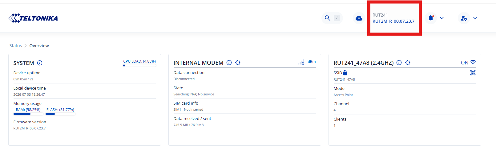
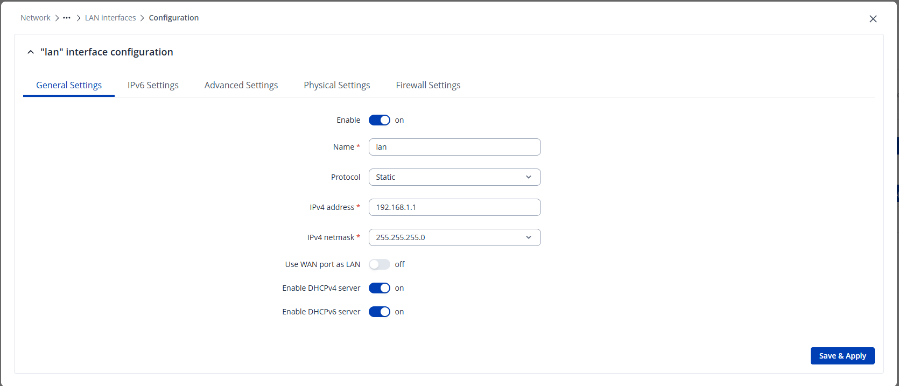
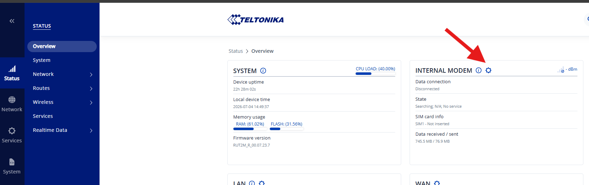
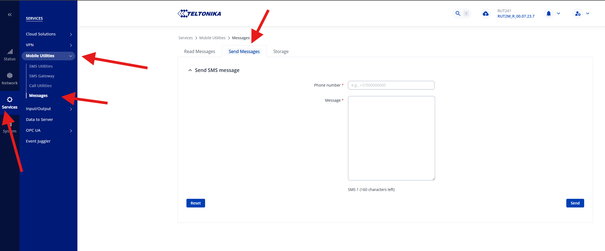
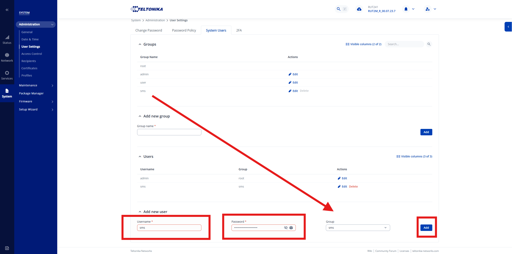

# Skicka SMS med Teltonika – Installation

## Konfigurera Teltonika

Innan pluginet kan importeras behöver Teltonika-routern anslutas och kontrolleras via sitt webbaserade gränssnitt.

1. Anslut till routern, antingen via Wi-Fi eller genom att koppla en dator till routern med en Ethernet-kabel. Wi-Fi-namnet (SSID) samt användarnamn och lösenord för anslutningen finns tryckt på undersidan av routern.
2. Vid anslutning via Wi-Fi tilldelar routerns DHCP-server automatiskt en IP-adress till datorn. Vid anslutning via Ethernet-kabel, antingen direkt till routern eller via en switch, måste datorns nätverkskort ha DHCP aktiverat, alternativt tilldelas en IP-adress manuellt inom samma subnät som routern. Routerns IP-adress står normalt tryckt på ovansidan och är vanligtvis `192.168.1.1`.
3. Öppna en webbläsare och navigera till routerns IP-adress. Detta tar dig till inloggningssidan för routern, se bild nedan:

    

4. Ange användarnamn och lösenord. Standarduppgifterna står tryckta på undersidan av routern.
5. När du loggat in visas routerns översiktssida. Verifiera att firmware-versionen på routern är densamma som eller nyare än den som listas under [vilka Teltonika-routrar stöds](oversikt.md#vilka-teltonika-routrar-stods). Aktuell version listas uppe till höger på översiktssidan, se bild nedan.

    

### Sätt IP-adress på routern

I de flesta fall vill man manuellt sätta en statisk IP-adress på routern. Inställningen för detta nås direkt på översiktssidan.

1. Klicka på kugghjulet direkt bredvid rubriken **LAN**.

    

2. Detta öppnar en ny dialog. Mata in önskad IP-adress och subnätsmask, och klicka därefter på **Save & Apply**.

    

    !!! warning "Uppdatera datorns IP-adress"
        När en ny IP-adress ställs in kommer kopplingen till routern att brytas. Se till att datorns IP-adress uppdateras för att matcha routerns nya IP-adress, och uppdatera därefter adressen i webbläsaren för att ansluta igen.

### Ange PIN-kod för SIM-kortet

Om SIM-kortet i routern är PIN-låst behöver PIN-koden anges i routerns gränssnitt, annars kan modemet inte ansluta till mobilnätet och SMS kan inte skickas.

1. Klicka på kugghjulet bredvid rubriken **Internal modem** på översiktssidan.

    

2. Ange SIM-kortets PIN-kod i fältet **PIN** under **SIM configuration**, och klicka därefter på **Save & Apply**.

    

!!! warning "Risk för PUK-låsning"
    Anges PIN-koden fel tre gånger låser sig SIM-kortet och kräver en PUK-kod för att låsas upp. Dubbelkolla PIN-koden innan den sparas. Om SIM-kortet ändå blir låst visar routern en avisering med länken **Unlock SIM here**, som öppnar en dialog för att ange PIN och PUK. PUK-koden fås från operatören som SIM-kortet tillhör, inte från Teltonika.

### Skicka ett testmeddelande

Innan pluginet importeras är det värt att verifiera att SIM-kortet och mobilnätsanslutningen fungerar, genom att skicka ett SMS direkt från routerns eget gränssnitt utan att blanda in pluginet.

1. Gå till **Services → Mobile Utilities → Messages** och välj fliken **Send Messages**.

    

2. Ange ett telefonnummer under **Phone number** och ett meddelande under **Message**, och klicka på **Send**. Kommer SMS:et fram är SIM-kortet och mobilnätsanslutningen korrekt konfigurerade.

### Skapa en användare

I nästa steg skapas en dedikerad användare i routern som Ethiris kan använda för att ansluta till den. Användaren tilldelas en egen grupp med minimala skrivrättigheter, begränsade till att skicka SMS, för att minska risken om användaruppgifterna skulle läcka.

1. Gå till **System → Administration → User Settings → System Users**. Under **Add new group**, ange ett gruppnamn, t.ex. `sms`, och klicka på **Add**.

    

2. Klicka på **Edit** bredvid den nyss skapade gruppen för att öppna dess konfiguration. Sätt **Write action** till `Allow` och begränsa **Write access** till `Services > Mobile Utilities > Messages > Send Messages`, så att gruppen endast får rättighet att skicka SMS. Klicka därefter på **Save & Apply**.

    

3. Gå tillbaka till **System Users** och lägg till en ny användare under **Add new user**. Ange användarnamn och lösenord, välj den nyss skapade gruppen (`sms`) och klicka på **Add**.

    

Användarnamnet och lösenordet som skapas här används senare för att konfigurera pluginet i Ethiris.

## Importera plugin

Det här avsnittet beskriver hur pluginet importeras till WideQuick som en resurs, så att WideQuick kan kommunicera med routern.

1. Ladda ner resursen från [Kentima.com](#TODO-add-download-link).
2. Importera resursen och välj **Replace all**. Är du osäker på hur man importerar resurser, se [Resurser och Resurspaket](../../bms/reference/Resources-and-Resource-package.md).
3. Pluginet är nu installerat. Se [Användning](anvandning.md) för hur du konfigurerar det i WideQuick.