# Universallicens - Skapa en licensnyckel

## Introduktion 

WideQuick License Config är ett verktyg från Kentima AB för att skapa och hantera universella licensnycklar anpassade för att köra WideQuick med en Universallicens. 
Den här guiden ger steg-för-steg-instruktioner för att generera en universell licensnyckel (wqlicense.key).

### Vad är WideQuick Universallicens?
WideQuick Universallicens gör det enkelt att köra WideQuick genom att ansluta till en central licensserver. Den här servern hanterar en gemensam pool av licenser, så att dina WideQuick-applikationer kan starta smidigt utan att behöva installera enskilda nycklar på varje enhet.

När du startar WideQuick kontaktar applikationen licensservern. Om en licensplats är tillgänglig checkar WideQuick ut den tillfälligt och körs normalt. Anslutningen tar bara några sekunder vid uppstart och förnyas tyst i bakgrunden – inga extra steg behövs från din sida.

### Varför är detta fördelaktigt?

-	Gör det möjligt för WideQuick att köras på vilken auktoriserad enhet som helst, till exempel stationära datorer, virtuella maskiner eller till och med containers.
-	Dela licenser effektivt inom ditt team – bara aktiva applikationer förbrukar platser.
-	Licenshanteringen blir mer dynamisk. Du kan när som helst ändra innehållet i licensen och du betalar bara för det du använder per WideQuick-applikationsinstans per månad.
-	Gör det möjligt att köra fler än en WideQuick-applikation på en enda enhet, till exempel en server som betjänar flera SCADA- och/eller HMI-lösningar.

## Förutsättningar

  -	Giltig universell produktnyckel från Kentima AB
    -	Denna nyckel kan användas för att skapa hur många licenser som helst, men som standard kan endast 10 platser utnyttjas samtidigt.
  -	WideQuick License Config-verktyget installerat
    -	Om du är partner med Kentima kan du ladda ned WideQuick License Config från vår webbplats.

## Skapa en licensnyckel

<figure markdown="span">
    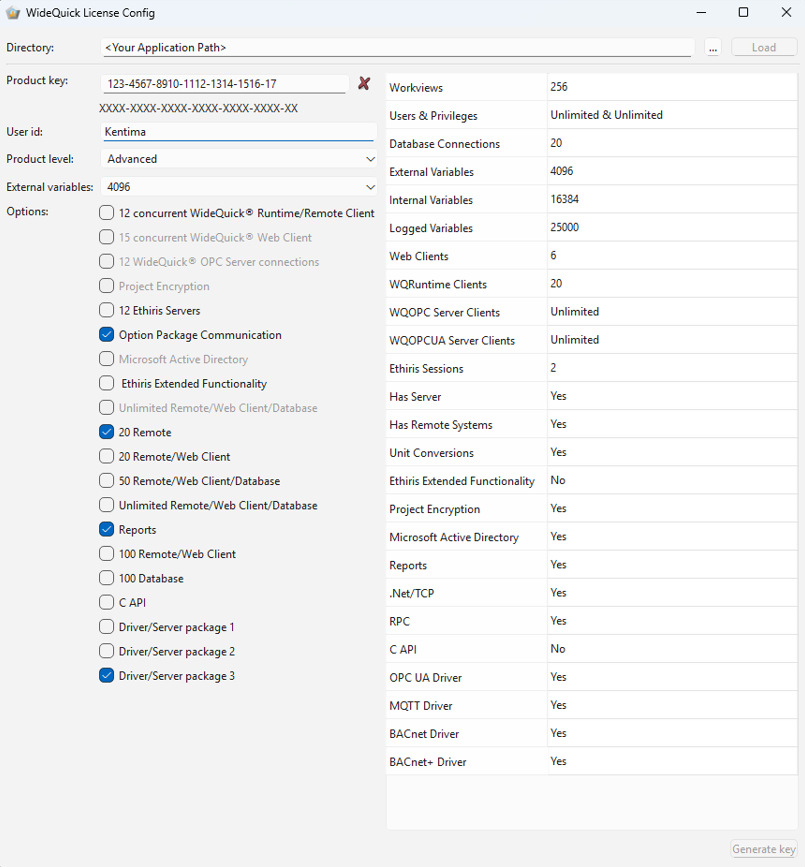
   <figcaption>WideQuick License Config grafiskt användargränssnitt.</figcaption>
</figure>


## Steg-för-steg-instruktioner

### 1.	Starta WideQuick License Config
 
  Öppna WideQuick License Config-applikationen från Start-menyn eller genvägen på skrivbordet.
  
  

  Som standard installeras verktyget i C:\Program Files\Kentima AB\WideQuick License Config följt av ett versionsnummer, till exempel C:\Program Files\Kentima AB\WideQuick License Config 14 
  

### 2.	Ange miljövariabeln WQ_CLOUD_LICENSE (Ej tillämpbart för containers)

  För att aktivera universell licensiering på en enhet som inte är en container, till exempel en server, stationär dator eller virtuell maskin, måste du ange en miljövariabel. Detta behöver göras på den enhet som är avsedd att köra WideQuick Runtime.

=== "On Windows"
    
    Gör följande för att ange en miljövariabel i Windows:

    1.	Tryck på Windows-tangenten, sök efter "Redigera miljövariabler" och välj "Redigera systemmiljövariabler."
    
    
    
    2.	Klicka på knappen "Miljövariabler."
    
    
    
    3.	Under "Systemvariabler" (för alla användare) eller "Användarvariabler" (bara för dig), klicka på "Ny." Om du redan har en miljövariabel med namnet WQ_CLOUD_LICENSE klickar du på Redigera istället.
    
    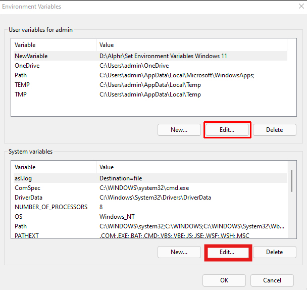

    4.	Ange Variabelnamn: WQ_CLOUD_LICENSE och Variabelvärde: 1.
        
        

    5.	Klicka på OK och starta om WideQuick eller starta om datorn för att ändringarna ska träda i kraft.

=== "On GNU/Linux"

    Gör följande för att ange en miljövariabel i ett GNU/Linux-system:

    1.	Öppna en terminal och redigera din skalprofilsfil. Du kan göra detta med till exempel nano via terminalen genom att skriva: 
        
        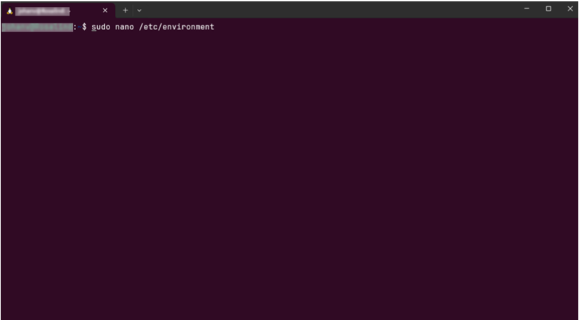
        
        === "For User"
            ```bash
            nano ~/.bashrc
            ```
        === "For System"
            ```bash
            sudo nano /etc/environment
            ```

    2.	Lägg till den här raden i slutet: 
        
        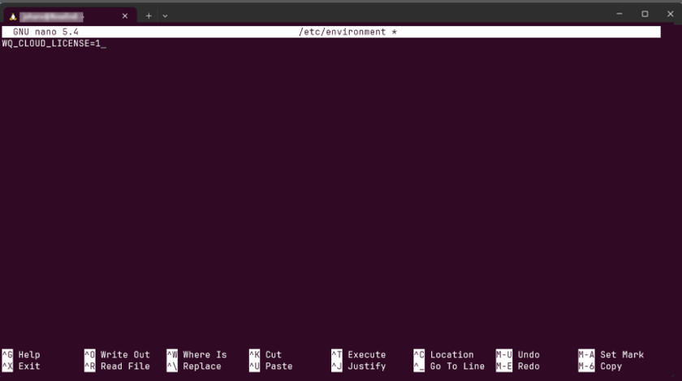

        === "For User"
            ```nano
            export WQ_CLOUD_LICENSE=1
            ```
        === "For System"
            ```bash
            WQ_CLOUD_LICENSE=1
            ```

    3.	Spara och avsluta (Ctrl+O, Enter, Ctrl+X i nano).

    4.	Tillämpa ändringarna:

        a.	För användare, skriv följande i terminalen: source ~/.bashrc (eller starta om).
        
        b.	För systemomfattande, starta om systemet.

--- 
### 3.	Ange en applikationskatalog

  Ange en sökväg i katalogfältet i WideQuick License Config-verktyget. 

  
  
  Det är i denna katalog som verktyget placerar filen wqlicense.key som gör det möjligt för WideQuick Runtime att hämta en licens från licensservern. 
  
  Nyckeln måste placeras i roten för den WideQuick-applikation du avser att köra.

!!! Info

    Rotkatalogen för en WideQuick-applikation är den katalog som innehåller WideQuick-applikationskonfigurationen. Ett bra sätt att kontrollera att du är i rätt katalog är att verifiera att det finns en Default.krun-fil i katalogen.

  Du kan bläddra till en sökväg genom att trycka på knappen ++"..."++. Om du redan har en giltig licensnyckel som du vill uppdatera kan du läsa in den aktuella licensen genom att trycka på knappen ++"load"++.

  Om du för tillfället inte befinner dig på den maskin som ska köra WideQuick Runtime-applikationen, eller om du inte har åtkomst till den applikation du vill köra just nu, kan du alltid kopiera licensnyckelfilen till rotkatalogen innan du driftsätter.

### 4.	Ange produktnyckel

  Ange din 24-tecken långa produktnyckel i formatet XXXX-XXXX-XXXX-XXXX-XXXX-XX. 
  
  

  Ett rött kryss <span style="color:red">(X)</span> indikerar en ogiltig nyckel. Om en giltig produktnyckel anges visas en grön bock <span style="color:green">(✓)</span> som bekräftelse.

  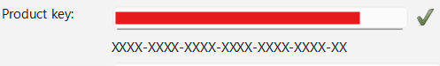

### 5.	 Ange användar-ID

  Ange ett användar-ID. Användar-ID:t rapporteras tillbaka till licensservern och är avsett att användas som ett sätt att skilja på till exempel vilken slutanvändare eller vilket projekt som utnyttjar denna licensnyckel.
  
  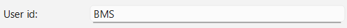

### 6.	 Välj produktnivå

  Välj önskad produktnivå från produktnivå-rullgardinsmenyn som du vill använda i din applikation. 
  
  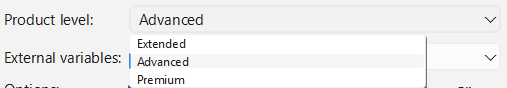

  När du gör det kommer du att märka att värdena i listan med licensierade funktioner ändras och markeras. Med högre licenser kan du även välja fler valfria funktioner och ett större antal externa variabler.

### 7.	Konfigurera externa variabler

  Ange antalet externa variabler som du avser att använda i din applikation. 
  
  
  
  Ett bra sätt att uppskatta hur många variabler du använder i ditt projekt är att öppna WideQuick-applikationen i WideQuick Designer och titta på variabelräknaren i det nedre högra hörnet av skärmen.

  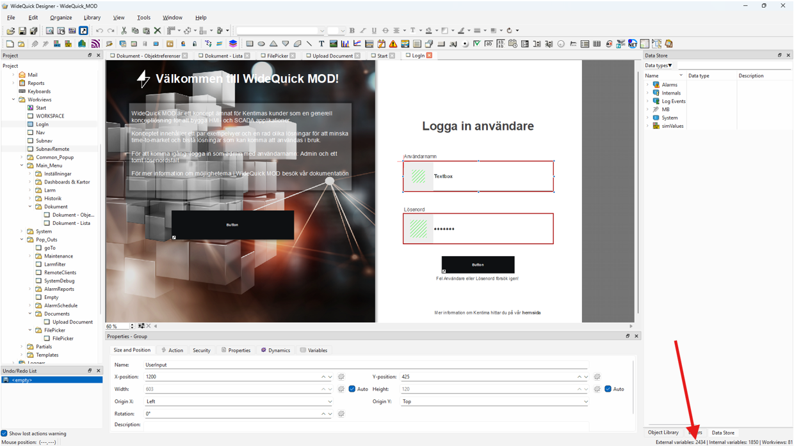

  Antalet interna variabler du tillåts använda är ungefär dubbelt så många som det angivna antalet externa variabler, men inom det specificerade intervallet. Detaljer om detta hittar du i WideQuick Licensing Table som finns tillgänglig för nedladdning på vår webbplats.

### 8.	Aktivera alternativ

  Utöver den funktionalitet som ingår i produktnivån kan du välja att lägga till ytterligare funktionalitet i din licens. 
  
  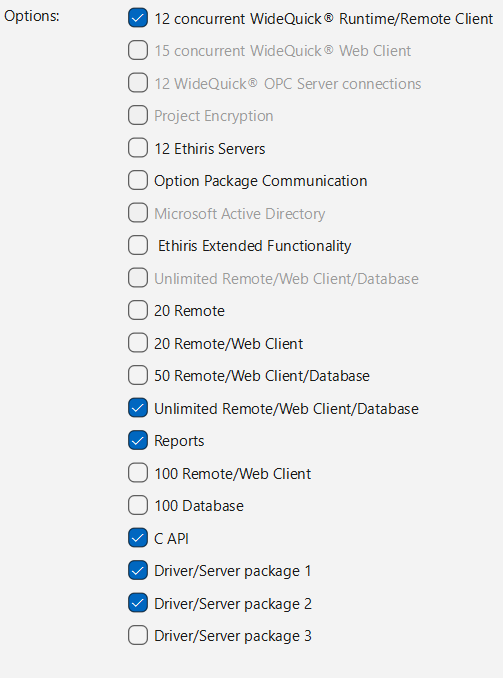

  Detta sträcker sig från ett ökat antal anslutningar till en viss funktion i WideQuick Runtime till att låsa upp helt ny funktionalitet, till exempel Rapporter, stöd för Active Directory eller åtkomst till andra kommunikationsdrivrutiner och programmeringsgränssnitt för C och Python.

### 9.	Verifiera konfigurationen

  Innan du genererar din licens är det god praxis att gå igenom ditt val av funktionalitet, eftersom detta är grunden för vad du kommer att debiteras. 

!!! Info
    Som nämnts ovan är det viktigt att du verifierar vilken licensnivå du har valt. Det är denna konfiguration som ligger till grund för vad som debiteras. 

  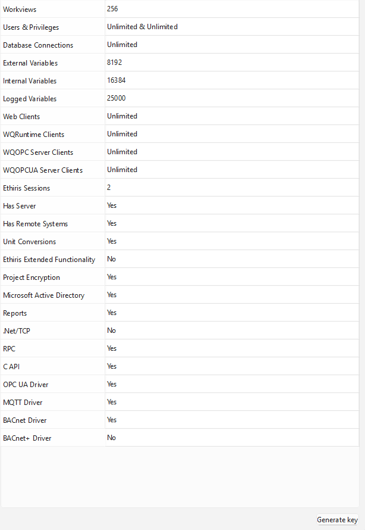

  Kontrollera att du är nöjd med ditt val innan du genererar din licens.

### 10.  Generera licensnyckel

  Klicka på Generera nyckel längst ned till höger i WideQuick License Config-skärmen. 
  
  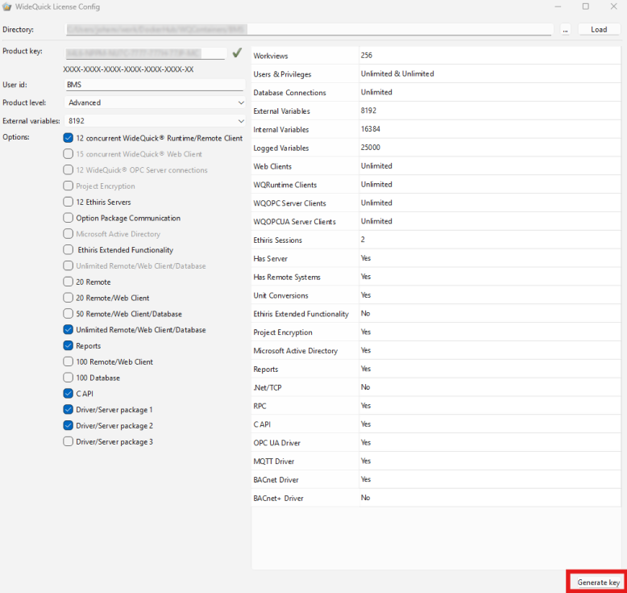
  

  Verktyget skapar sedan din wqlicense.key-fil och placerar den i den valda katalogen du angav i katalogfältet.

 

## Felsökning

### Ogiltig produktnyckel: 

  Verifiera att produktnyckeln verkligen är ogiltig genom att ange den i produktnyckelfältet i WideQuick License Config-verktyget.
  
  Om den verkligen verkar vara felaktig, kontrollera att du har den tilldelade nyckeln som gavs till dig vid köptillfället.
  
  Om ovanstående åtgärder inte hjälpte, kontakta support@kentima.se med dina köpuppgifter.

### Genereringen misslyckades: 
  
  Kontrollera att alla fält är ifyllda. Försök igen och se till att du använder en giltig produktnyckel och en giltig katalogsökväg.

### Förväntad funktion är inte upplåst i WideQuick Runtime: 

  Börja med att isolera den funktion du misstänker inte är upplåst i en WideQuick-applikation utan andra beroenden. Detta hjälper dig att verifiera om funktionen verkligen inte är upplåst. 

  Om så är fallet, generera en ny licensnyckel och försök igen.

  Om du fortfarande inte lyckas låsa upp funktionen, kontakta WideQuick-supportteamet på support@kentima.se

### WideQuick Runtime verkar inte starta

  För att använda universalnyckeln på en enhet som inte är en container måste miljövariabeln WQ_CLOUD_LICENSE vara satt till 1. 
  
  Kontrollera att detta är fallet. 
