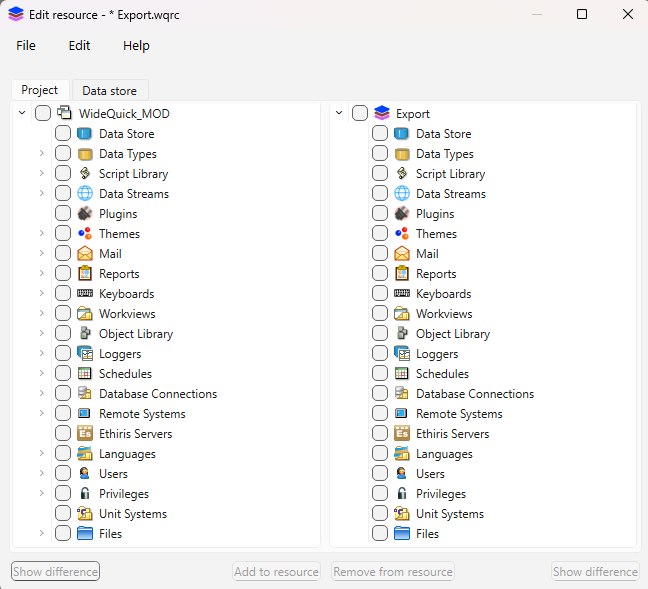

<!-- --8<-- [start:body] -->

Resources
===
WideQuick has a built in interface for exporting and importing resources. This allows the user to easily transfer parts from one project to another and avoid faulty implementation of resources.  

## Exporting resources { #exporting-resources }
In order to export resources from WideQuick correctly, press the following button which can be found in the toolbar 

This will bring up the following window

From here click ++"File"++ and select new or use the keyboard shortcut "ctrl + n". This allows the user to create their .wqrc file containing the resources that will be exported. Choose a suitable name and where the file will be saved. Once this is done the following window will be brought up

The left side represent the resources in the current project while the right side is export file. Select the files in the project that will be exported. Once the files are selected press ++"Add to resources"++ this will make a copy of the files in the export file, the files copied will be highlighted in the export side. When all files that are going to be exported have been copied into the export side, press ++"File"++ and ++"Save"++. Now the export file has been saved and ready to be imported into a new project. 

### Exporting more to a existing export { #exporting-more-to-a-existing-export }
If the user already have a existing export file and want to add more resources to that file. Simply follow the [Exporting resources](#exporting-resources) but press ++"Open"++ instead of creating a new export file and select the existing export file. 

## Importing resources { #importing-resources }
Importing resources in WideQuick is simple and follow the same process as exporting. Click the "Resource" button in the tool bar.

This will bring up the following window

From here press ++"Files"++ and select ++"Import from.."++ This will bring up the explorer, select the .wqrc file that contains the imports and press open. This will bring up the following window 

In this window all the files in the .wqrc file will be displayed. By default all files are selected. If the files already exist or have the same name, the description under "Duplicates" will say "Skip". By clicking "Skip" the user can change it to "Duplicate" or "Replace", these options loop by repetitively clicking. Once the desired files are selected and their "Duplicates" status is correct. Press ++"Import"++ to import the files. This will bring up a window displaying results, containing three descriptions. 

* Resource - The specific resource that was imported
* Status - Shows if it was Skipped, Duplicated or Replaced
* Message - Tells if a error occurred. An empty message means no error

Now the files have been imported to the project. 

