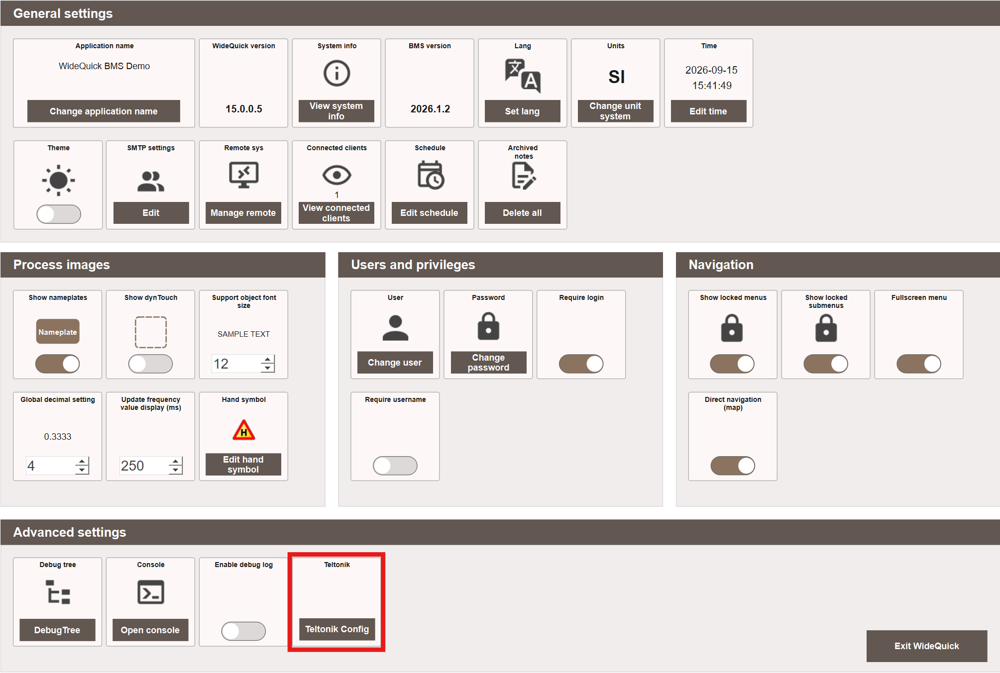
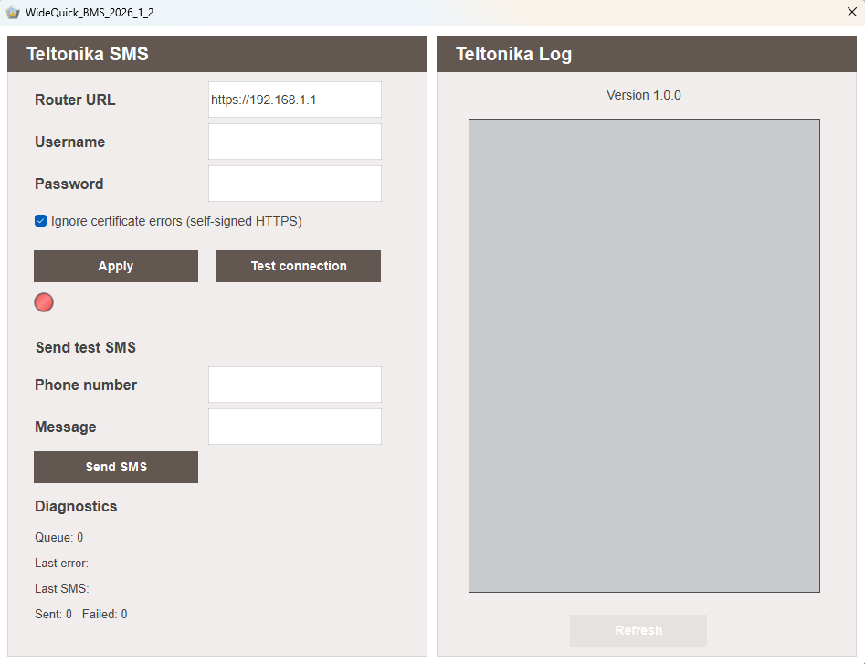

# Send SMS with Teltonika – Usage

The plugin works almost as a drop-in replacement for WideQuick's built-in GSM Modem system, and requires no scripting. Once it has been [imported as a resource](installation.md#import-the-plugin), it is configured entirely from the Settings view.

## Configure the plugin

1. Start **WideQuick® Runtime** in the project where the plugin was imported.
2. Navigate to **Settings**.
3. Under **Advanced settings**, click **Teltonik Config**.

    {align=center}

    This opens the **Teltonika SMS** configuration dialog.

    {align=center}

4. Enter the same **Router URL**, **Username**, and **Password** used when [creating the router user](installation.md#create-a-user) during installation.
5. Click **Apply** to save the configuration.
6. Click **Test connection** to verify that the connection works. The indicator turns green once WideQuick successfully connects to the router.

!!! note "Ignore certificate errors"
    **Ignore certificate errors (self-signed HTTPS)** is enabled by default, since the router's built-in certificate is self-signed and not issued for its local IP address. See [Certificate valid for the router's IP address](avancerat.md#certificate-valid-for-the-routers-ip-address) under Advanced if you would rather not disable certificate validation.

## Send a test SMS

Once connected, use **Send test SMS** to verify that sending works end to end:

1. Enter a **Phone number** and a **Message**.
2. Click **Send SMS**.

**Diagnostics** shows the current queue length, the last error (if any), the last SMS sent, and running totals for sent and failed messages.

## Teltonika Log

The **Teltonika Log** panel lists every message sent through the plugin, along with any errors, making it possible to track deliveries and diagnose failed sends. Click **Refresh** to update the log.

## Automatic sending from alarms

Once the plugin is configured, it automatically sends SMS for any [alarm notification schedule](../../mod/modules/Core/alarms/configuring.md#alarm-notification-schedules) already set up to notify by SMS – no further setup is required.

!!! note "Enable compact mode"
    It's recommended to enable compact mode for SMS in the schedule configuration. This keeps messages short instead of sending the full, detailed alarm text.
