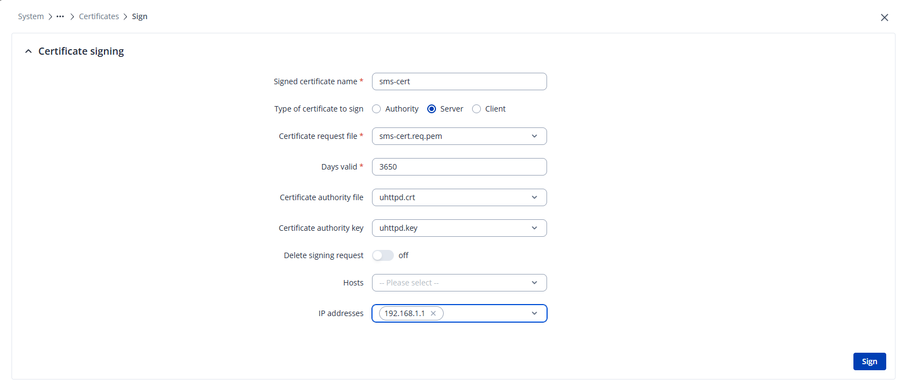
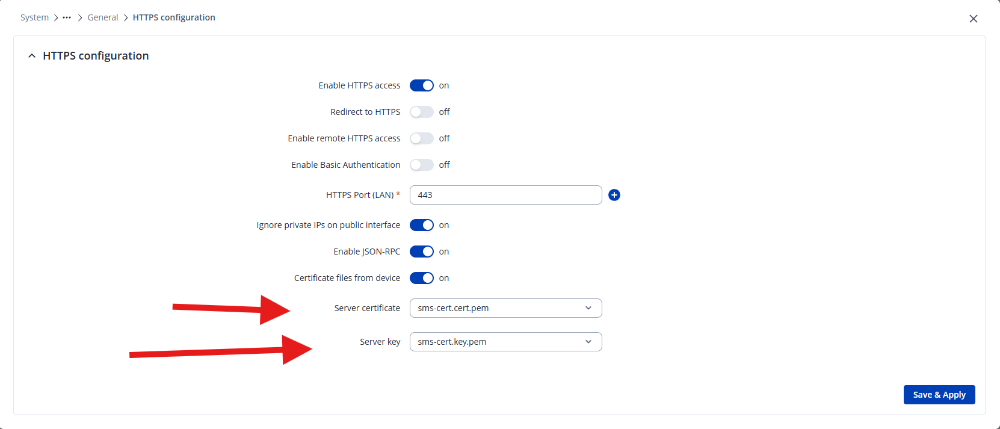

# Send SMS with Teltonika – Advanced

## Certificate valid for the router's IP address

As an alternative to `SetIgnoreCertificateErrors(true)` (see [Usage](anvandning.md)), it is possible to create a certificate that the router actually trusts for its IP address, and then trust that certificate on the server computer running WideQuick. This avoids disabling certificate validation entirely.

A public certificate authority (CA), such as Let's Encrypt, never issues certificates for private IP addresses (RFC 1918, e.g. `192.168.1.1`). The Teltonika router does, however, have its own built-in CA (`uhttpd.crt` / `uhttpd.key` – the same CA the router's own web interface is signed with) that can sign a certificate with the IP address included as a Subject Alternative Name (SAN). The certificate is created in two steps: first a certificate signing request (CSR) is generated, which is then signed separately with the router's IP address given as SAN.

### 1. Create a certificate signing request (CSR)

1. Go to **Certificates** in the router's admin interface (**System → Administration → Certificates**) and click **Create**.

    

2. Fill in the form as follows:

    

    | Field | Value |
    |------|-------|
    | File type | `Server` |
    | Key size | `2048` (the default is fine) |
    | Name (CN) | Optional, descriptive name – e.g. the router's IP address or `sms-cert`. It's only used to identify the certificate in the list; the actual address validation happens via SAN in the next step. |
    | Subject information (CC/ST/L/O/OU) | Optional. Pure metadata fields with no functional effect – can be left blank or filled in, e.g. Organization = `Kentima`. |
    | Sign the certificate | **Off** – the certificate is signed separately in the next step, which is where the SAN field for IP addresses is found. |

3. Click **Create**. This creates a private key and a certificate request, without signing it.

### 2. Sign the request with the router's IP address as SAN

1. Find the newly created request in the certificate list. The name from **Name (CN)** results in two entries: a private key (`<name>.key.pem`) and a request of type **Request** (`<name>.req.pem`).

    

2. Select the request (type `Request`) and open **Certificate actions → Sign**:

    

    | Field | Value |
    |------|-------|
    | Signed certificate name | Name for the finished, signed certificate, e.g. `sms-cert`. |
    | Type of certificate to sign | `Server` (the same type selected when creating the request). |
    | Certificate request file | The request of type `Request`, e.g. `sms-cert.req.pem`. |
    | Days valid | Validity period in days, e.g. `3650` for 10 years. |
    | Certificate authority file / key | `uhttpd.crt` / `uhttpd.key` – the router's built-in, preinstalled CA. Can be left at the default. |
    | Delete signing request | **Off** – otherwise the request cannot be re-signed later, e.g. to add more SAN entries. |
    | Hosts | Any hostnames/domain names to include as SAN – leave empty if connecting via IP address. |
    | IP addresses | Enter the router's IP address (e.g. `192.168.1.1`) and add it – the address is then shown as a tag in the field. This adds the address as a Subject Alternative Name (SAN). |

3. Click **Sign**.
4. Go to **System → Administration → Access Control** and click **Edit** on the **HTTPS** row (the same setting is also reached via **System → General → HTTPS configuration**):

    

5. Change **Server certificate** / **Server key** to the newly signed certificate and its key (`sms-cert.cert.pem` / `sms-cert.key.pem`). Click **Save & Apply**.

    

### 3. Trust the certificate on the server computer

The signed certificate that the router presents to the client during the TLS connection (`sms-cert`) contains the SAN with the IP address. But for the Windows computer running WideQuick Server to trust that certificate, it must be able to verify who issued it – that's why it's the CA (the router's own issuer), not the signed certificate, that needs to be imported. By trusting the issuer, Windows automatically trusts everything that CA signs, both now and at a future renewal (e.g. if the router's IP address changes and the certificate needs to be re-signed) – without the import having to be redone every time.

1. Export the CA certificate `uhttpd.crt` (only the CA certificate, not the router's signed certificate or private keys) from the Certificates page.
2. Import the CA certificate into **Trusted Root Certification Authorities** on the Windows computer running WideQuick Server, either via `certmgr.msc` or with PowerShell:

    ```powershell
    Import-Certificate -FilePath "ca.crt" -CertStoreLocation Cert:\LocalMachine\Root
    ```

After this, Windows/.NET trusts the certificate – both the trust chain (via the imported CA) and the address match (via the IP address in SAN) check out, and `SetIgnoreCertificateErrors(true)` is no longer needed in the script.

!!! note "Worth keeping in mind"
    If the router's IP address changes, the certificate needs to be recreated with the new address as SAN. With multiple routers, it's simpler to set up your own CA and sign all the routers' certificates with it, so that only one CA needs to be trusted instead of one per device.

## Function reference

In addition to the functions already used in [Usage](anvandning.md), the plugin includes a number of functions for diagnostics and operation. The plugin communicates with the router via a built-in REST client, but you normally don't need to worry about that – the SMS functions below cover most needs.

| Function | What it does |
|---|---|
| `PluginInfo.Version()` | Returns the plugin's version, e.g. `"1.0.0"` – a good sanity check right after deployment or an upgrade. |
| `SmsClient.GetQueueLength()` | Number of SMS messages currently waiting in the background queue. |
| `SmsClient.GetLastSmsStatus()` | The result of the most recently completed send, e.g. `"OK 2026-07-03 12:01:44 +46701234567"` or `"FAILED 2026-07-03 12:01:44 +46701234567: <reason>"`. Empty string until the first send has completed. |
| `SmsClient.GetSentCount()` / `GetFailedCount()` | Counters since the service was last started. Can be polled to detect a successful or failed send as an "event" (compare the value between each run), or to monitor a dead modem or incorrect login credentials in production. |
| `SmsClient.GetLog()` / `GetLog(maxLines)` | The most recent log lines (default 50, buffer holds up to 200 lines) – suitable for showing in a diagnostics view. |
| `SmsClient.ClearLog()` | Clears the in-memory log. |
| `SmsClient.SetLogFile(path)` | Mirrors the log to a file so the history survives a restart of the service (the in-memory log does not). An empty string (`""`) turns file logging off again. |
| `RestClient.SetTimeoutSeconds(n)` | HTTP timeout in seconds, default `10`. Also affects how long `SendSmsWait()` can block in the worst case (roughly 8 × timeout, ~80 s with the default) if a queued send is retrying at the same time. |

## Troubleshooting

| Symptom | What to do |
|---|---|
| SMS never arrives | Check `GetLastSmsStatus()` and `GetLastError()` – they contain the router's error reason (e.g. failed login or unreachable router). |
| Need a history of what happened | `GetLog(200)` shows the last 200 plugin events: configuration, sends, retries, and discarded messages. |
| Need history that survives a restart | Call `SetLogFile("C:\\Logs\\sms.log")` once at startup, then read the file. |
| The "not configured" error | `Configure()` has not been run in this process – check that the script library holding the configuration is actually being loaded. |
| Nothing works after deployment or an upgrade | Run `PluginInfo.Version()` from a script. If the call fails, the DLL isn't loaded – check `ScriptPluginAssemblies` and that the service has been restarted (see [Import the plugin](installation.md#import-the-plugin)), and that no old DLL files are left behind. |
| `HTTP 401`, or a log line starting with `router redirected http:// to https://` | The router requires https – check that `url` in `Configure(...)` starts with `https://`, and that **Redirect to HTTPS** is enabled under **System → Administration → Access Control → HTTPS** if you're unsure. |
| `"Modem 'X' not found on this router"` | The modem id given in `Configure(...)` does not exist on the router. `GetLastError()` lists the router's actual modem ids – fix the argument, or use the three-argument variant of `Configure()` to let the plugin auto-detect the modem instead. |
