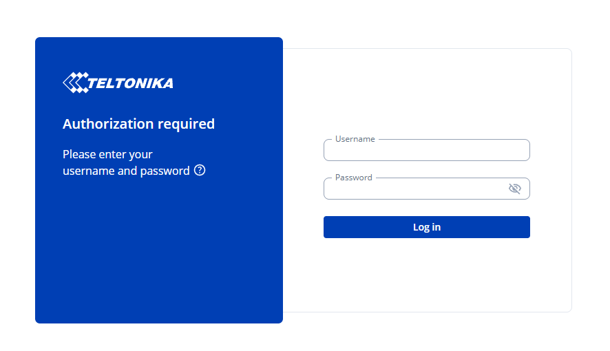
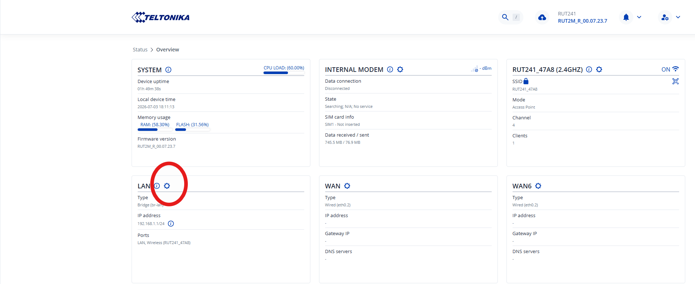
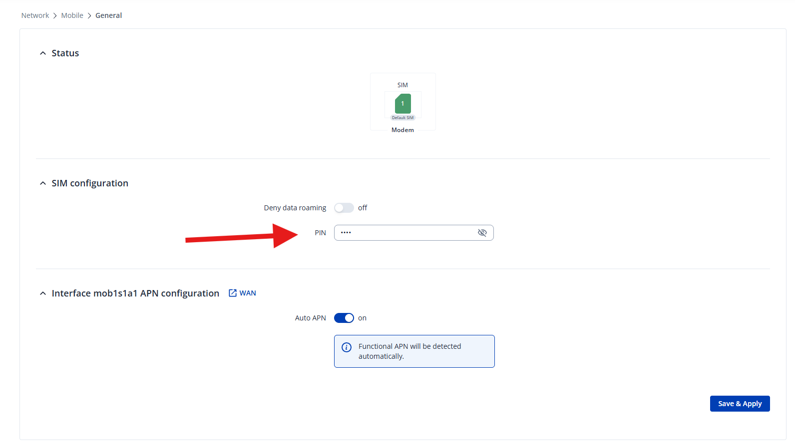
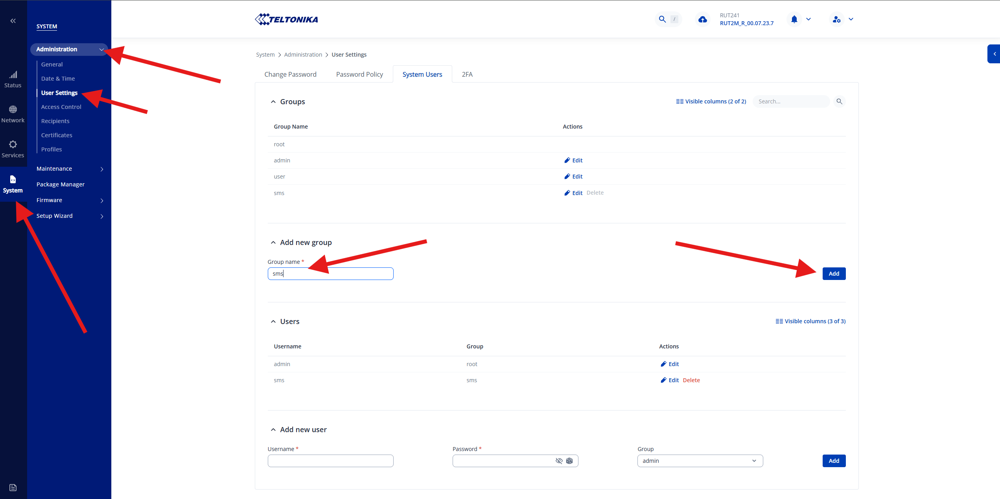
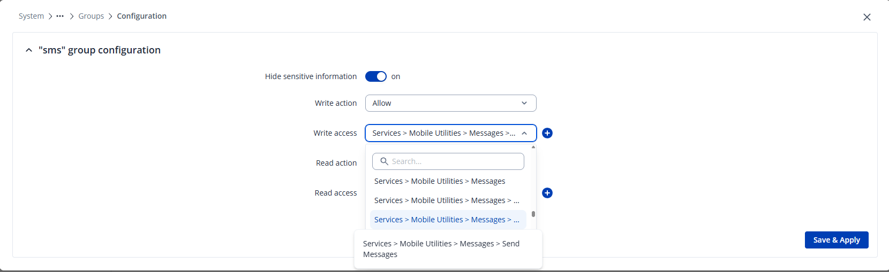

# Send SMS with Teltonika – Installation

## Configure Teltonika

Before the plugin can be imported, the Teltonika router needs to be connected and checked via its web-based interface.

1. Connect to the router, either via Wi-Fi or by connecting a computer to the router with an Ethernet cable. The Wi-Fi name (SSID) and the username and password for the connection are printed on the underside of the router.
2. When connecting via Wi-Fi, the router's DHCP server automatically assigns an IP address to the computer. When connecting via an Ethernet cable, either directly to the router or via a switch, the computer's network adapter must have DHCP enabled, or be assigned an IP address manually within the same subnet as the router. The router's IP address is normally printed on the top and is usually `192.168.1.1`.
3. Open a web browser and navigate to the router's IP address. This takes you to the router's login page, shown below:

    

4. Enter the username and password. The default credentials are printed on the underside of the router.
5. Once logged in, the router's overview page is displayed. Verify that the router's firmware version is the same as, or newer than, the one listed under [which Teltonika routers are supported](oversikt.md#which-teltonika-routers-are-supported). The current version is listed at the top right of the overview page, shown below.

    

### Set the router's IP address

In most cases, you will want to manually set a static IP address on the router. This setting is accessed directly from the overview page.

1. Click the gear icon right next to the **LAN** heading.

    

2. This opens a new dialog. Enter the desired IP address and subnet mask, then click **Save & Apply**.

    

    !!! warning "Update the computer's IP address"
        When a new IP address is set, the connection to the router will be broken. Make sure the computer's IP address is updated to match the router's new IP address, then update the address in the browser to reconnect.

### Enter the PIN code for the SIM card

If the SIM card in the router is PIN-locked, the PIN code needs to be entered in the router's interface, otherwise the modem cannot connect to the mobile network and SMS messages cannot be sent.

1. Click the gear icon next to the **Internal modem** heading on the overview page.

    

2. Enter the SIM card's PIN code in the **PIN** field under **SIM configuration**, then click **Save & Apply**.

    

!!! warning "Risk of PUK lock"
    Entering the PIN code incorrectly three times locks the SIM card, requiring a PUK code to unlock it. Double-check the PIN code before saving it. If the SIM card does get locked, the router shows a notification with an **Unlock SIM here** link, which opens a dialog for entering the PIN and PUK. The PUK code is obtained from the mobile operator the SIM card belongs to, not from Teltonika.

### Send a test message

Before importing the plugin, it is worth verifying that the SIM card and mobile network connection work, by sending an SMS directly from the router's own interface without involving the plugin.

1. Go to **Services → Mobile Utilities → Messages** and select the **Send Messages** tab.

    

2. Enter a phone number under **Phone number** and a message under **Message**, then click **Send**. If the SMS arrives, the SIM card and mobile network connection are correctly configured.

### Create a user

The next step is to create a dedicated user on the router that Ethiris can use to connect to it. The user is assigned its own group with minimal write permissions, restricted to sending SMS, to reduce the risk if the user's credentials were to leak.

1. Go to **System → Administration → User Settings → System Users**. Under **Add new group**, enter a group name, e.g. `sms`, and click **Add**.

    

2. Click **Edit** next to the newly created group to open its configuration. Set **Write action** to `Allow` and restrict **Write access** to `Services > Mobile Utilities > Messages > Send Messages`, so that the group is only permitted to send SMS. Then click **Save & Apply**.

    

3. Go back to **System Users** and add a new user under **Add new user**. Enter a username and password, select the newly created group (`sms`), and click **Add**.

    

The username and password created here are used later to configure the plugin in Ethiris.

## Import the plugin

This section covers importing the plugin into WideQuick as a resource, so that WideQuick can communicate with the router.

1. Download the resource with the link provided by Kentima
2. Import the resource and select **Replace all**. If you are unsure how to import resources, see [Resources and Resource package](../../bms/reference/Resources-and-Resource-package.md).
3. The plugin is now installed. See [Usage](anvandning.md) for how to configure it in WideQuick.
