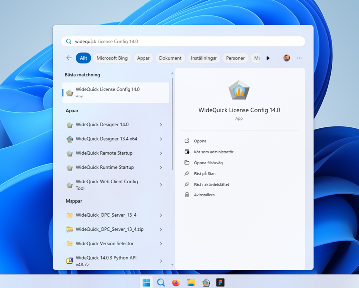
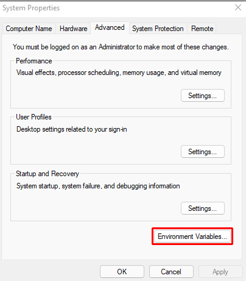
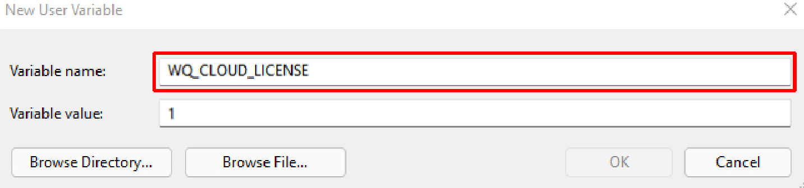
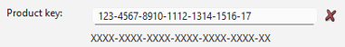
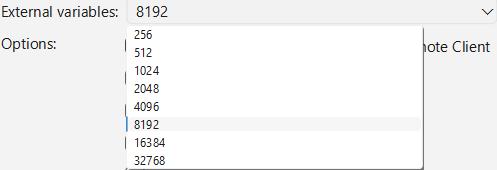

# Universal License - Create a license key

## Introduction 

WideQuick License Config is a tool provided by Kentima AB to create and manage universal licenses keys tailored to running WideQuick with a Universal License. 
This guide provides step-by-step instructions for generating a universal license key (wqlicense.key).

### What is WideQuick Universal License?
WideQuick Universal License makes it easy to run WideQuick by connecting to a central license server. This server manages a shared pool of licenses, so your WideQuick Applications can start up smoothly without installing individual keys on each device.

When you launch WideQuick, the application contacts the license server. If a license seat is available, WideQuick checks it out temporarily and runs normally. The connection only takes seconds at startup and renews quietly in the background, no extra steps needed from you.

### Why is this beneficial?

-	Enables WideQuick to run on any authorized device such as desktops, Virtual Machines, or even containers.
-	Share licenses effectively across your team, only active applications consume seats.
-	Licensing becomes more dynamic. You may change the contents of the license at any time, you only pay for what you use per WideQuick Application instance monthly.
-	Enables you to run more than one WideQuick Application on a single device, such as a server that serves multiple SCADA and/or HMI solutions.

## Prerequisites

  -	Valid Universal Product Key from Kentima AB
    -	This key can be used to create as many licenses as you wish, however, by default only 10 seats can be utilized concurrently.
  -	WideQuick License Config tool installed
    -	If you are a partner of Kentima, you can download WideQuick License Config from our website.

## Creating a License Key

<figure markdown="span">
    
   <figcaption>WideQuick License Config Graphical User Interface.</figcaption>
</figure>


## Step-by-Step Instructions

### 1.	Launch WideQuick License Config
 
  Open the WideQuick License Config application from your Start menu or desktop shortcut.
  
  

  By default, the tool is installed to C:\Program Files\Kentima AB\WideQuick License Config followed by a version number such as C:\Program Files\Kentima AB\WideQuick License Config 14 
  

### 2.	Set the environment variable WQ_CLOUD_LICENSE (Not applicable to containers)

  To enable Universal licensing on a non-container device such as a server, desktop or Virtual Machine, you will need to set an environment variable. This needs to be done on the device that is intended to run WideQuick Runtime.

=== "On Windows"
    
    To set a environment variable on Window do the following:

    1.	Press Windows key, search for "Edit Environment Variables," and select "Edit the system environment variables."
    
    
    
    2.	Click "Environment Variables" button.
    
    
    
    3.	Under "System variables" (for all users) or "User variables" (for you only), click "New." If you already have a environment variable named WQ_CLOUD_LICENSE press edit instead.
    
    

    4.	Enter Variable name: WQ_CLOUD_LICENSE and Variable value: 1.
        
        

    5.	Click OK, restart WideQuick or reboot your machine for changes to apply

=== "On GNU/Linux"

    To set an environment variable on a GNU/Linux system:

    1.	Open a terminal and edit your shell profile, you can do this with for example nano via you terminal by entering: 
        
        
        
        === "For User"
            ```bash
            nano ~/.bashrc
            ```
        === "For System"
            ```bash
            sudo nano /etc/environment
            ```

    2.	Add this line at the end add: 
        
        

        === "For User"
            ```nano
            export WQ_CLOUD_LICENSE=1
            ```
        === "For System"
            ```bash
            WQ_CLOUD_LICENSE=1
            ```

    3.	Save and exit (Ctrl+O, Enter, Ctrl+X in nano).

    4.	Apply changes:

        a.	For user, type the following into your terminal: source ~/.bashrc (or reboot).
        
        b.	For system wide, reboot the system.

--- 
### 3.	Enter an Application Directory

  Enter a path in the directory field in the WideQuick License Config Tool. 

  
  
  This directory is where the tool will place the wqlicense.key-file that allows WideQuick Runtime to collect a license to run from the license server. 
  
  The key needs to be placed in the root of the WideQuick Application you intend to run.

!!! Info

    The root directory for a WideQuick Application is the directory containing the WideQuick Application Configuration. A good way to see if you are in the right directory is verifying there is a Default.krun file in the directory

  You can browse a path by pressing the ++"..."++ button. If you already have a valid license key you want to update you may bring up the current license by pressing the ++"load"++ button.

  If you are not currently on the machine that will run the WideQuick Runtime application or do not have access to the application you wish to run at the time. You can always copy the license key file into the root directory before deploying.

### 4.	Enter Product Key

  Input your 24-character Product Key in the format XXXX-XXXX-XXXX-XXXX-XXXX-XX. 
  
  

  A red cross <span style="color:red">(X)</span> indicates an invalid key. If a valid Product Key is provided, a green checkmark <span style="color:green">(✓)</span> indicates so.

  

### 5.	 Input User ID

  Enter a User ID, the user id is reported back to the license server and is intended to be used as a measure to distinguish for example, which end-user or project is utilizing this license key.
  
  

### 6.	 Select Product Level

  Choose the intended product level from the product level dropdown that you wish to use in your application. 
  
  

  As you do so you will notice that values in the list of licensed functions will change and become highlighted. With the higher licenses also allowing you to pick more optional feature and a larger set of External Variables.

### 7.	Configure External Variables

  Enter the number of External Variables you intend to use in your application. 
  
  
  
  A good way to gauge how many variables you are using in your project is to open the WideQuick Application in WideQuick Designer and look at the variable counter in the bottom-right corner of your screen.

  

  The number of internal variables you are allowed to use are about twice as many variables but within the specified range. The specifics of this you can find in the WideQuick Licensing Table available for download on our website.

### 8.	Enable Options

  In addition to the functionality included in the product level you may choose to add in additional functionality to your license. 
  
  

  This ranges from an increased amount of connection to a certain function in WideQuick Runtime to unlocking completely new functionalities such as Reports, support for Active Directory or access to other Communication Drivers and Application Programming Interfaces for C and Python.

### 9.	Verify Configuration

  Before you generate your license it is good practice to look over your selection of functionality as this is the basis for what you will be billed. 

!!! Info
    As stated above, it is vital you verify what level of licensing you have chosen. It is this configuration that is the basis for what is billed. 

  

  Verify that you are satisfied with your selection before generating your license.

### 10.  Generate License Key

  Click Generate key at the bottom-right of the WideQuick License Config screen. 
  
  
  

  The tool goes on to create your wqlicense.key file and place it in the selected directory you have selected in the Directory field.

 

## Troubleshooting

### Invalid Product Key: 

  Verify that the Product Key is indeed invalid by entering it into the product key field in the WideQuick License Config Tool.
  
  If it indeed seems to be incorrect, control that you have the assigned key given to you at the time of purchase.
  
  If previous measures did not help. Contact support@kentima.se with your purchase details.

### Generation Failed: 
  
  Verify all fields are complete. Try again make sure you are using a valid product key and a valid directory path.

### Expected function not unlocked in WideQuick Runtime: 

  Start off by isolating the function you suspect is not unlocked in a WideQuick Application without any other dependencies. This help you verify whether the function is not unlocked. 

  If not, generate a new license key and try again.

  If you still do not manage to unlock the function, get in contact with the WideQuick support team at support@kentima.se

### WideQuick Runtime does not seem to start

  To use the universal key on a non-container device you will need the WQ_CLOUD_LICENSE environment variable to be set to 1. 
  
  Ensure this is the case. 


 
