Install WideQuick Runtime
====

  
## Installing the program
### System requirements
 **WideQuick®** consists of a Designer part, a Runtime part and a Remote part. You may install any part using the same installation program.
 Together with **WideQuick®** Designer you may also install a demo. The demo contains some examples on how to use the program.
 
 To use **WideQuick®** Designer, you will need the following or better:

 - An x86-64 (Intel 64/AMD64) processor.
 - 4 096 MB RAM
 - 300 MB available hard drive space
   
 
 To use **WideQuick®** Runtime or **WideQuick®** Remote, you will need the following or better:
   
- An x86-64 (Intel 64/AMD64) processor.
- 4 096 MB RAM
- 300 MB available hard drive space
    
  

**WideQuick®** products are supported on the following operating systems:    

-  Windows 7 embedded (64-bit)
-  Windows 10 (64-bit)
-  Windows 11 (64-bit)
-  Windows Server 2016 or newer (64-bit)
-  Debian GNU/Linux 9.0 (64-bit)
    
  

## Installation procedure

  __**WideQuick®** Designer__ and __**WideQuick®** Runtime__ must be installed on your hard drive from the downloaded installation package.

  The installation program for **WideQuick®** is delivered via download. Follow the instructions below to install **WideQuick®** on your computer.

  Installation procedure for **WideQuick®**:
#### Run the install file

 Run the install file on the computer where you wish to install WideQuick®

#### Welcome to the installation program for **WideQuick®**
  The first dialogue welcomes you to the installation program for **WideQuick®**.
<figure markdown="span">
   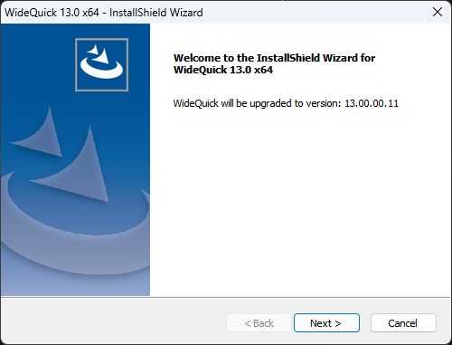{width=400}
  <figcaption>The welcome dialogue in the installation program for WideQuick®.</figcaption>
</figure>

  Click ++"Next >"++ to continue the installation.
    
#### The license agreement

<figure markdown="span">
   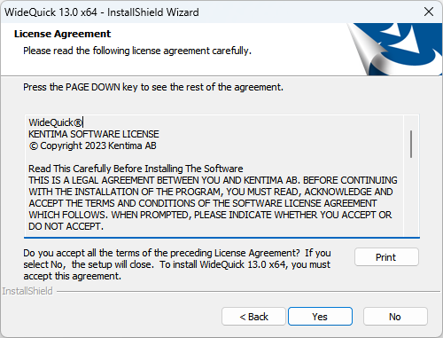{width=400}
  <figcaption>The license agreement.</figcaption>
</figure>

   Read the agreement carefully and click ++"Yes"++ to accept the agreement and continue the installation.

 
   
#### Filling out personal information
   
   The next step in the installation is filling out information about who you are and who will be allowed to run **WideQuick®** on this computer.
    

<figure markdown="span">
   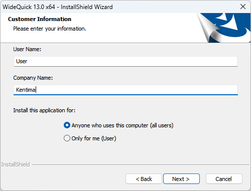{width=400}
  <figcaption>Dialogue for filling out personal information.</figcaption>
</figure>
 
   Fill in your name and company, if relevant. 
    
   You may also choose between installing **WideQuick®** for all users, or just for yourself. “All users” means that **WideQuick®** can be run regardless of who is logged into the computer.
    
   If you select “Only for me”, **WideQuick®** can only be run when you yourself are logged on.
    
   Make your selection and click ++"Next >"++ to continue.
#### Setup type
 
   The next dialogue allows you to choose setup type.
<figure markdown="span">
   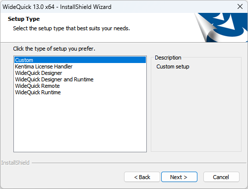{width=400}
  <figcaption>Dialogue for choosing setup type.</figcaption>
</figure>
  
 
 
   Custom gives you the option of choosing installation folder. Custom gives you the option of choosing which program features you wish to install.

   If you decide to choose one of the programs, they will be installed in the standard folder, which is normally C:\Program Files\Kentima AB\WideQuick.
    
   WideQuick Designer means that the entire **WideQuick®** Designer as well as a features demo will be installed.
    
 
   WideQuick Remote and WideQuick Runtime mean that only those files required to run **WideQuick®** Remote and **WideQuick®** Runtime respectively will be installed on your computer.
    
   If you are happy with the standard installation folder, choose WideQuick Designer, WideQuick Remote or WideQuick Runtime, depending on which program you wish to install. You must have a product code for the programs you wish to install. Once you have made your selection, click ++"Next >"++ to continue the installation. Move on to the next section if you have chosen Custom, otherwise you may go straight to [**Install WideQuick® Runtime**](#install-widequick-runtime) in the instructions.

#### Custom Installation
   
   If you have chosen a Custom installation, you now have the option of choosing which program features to install.

<figure markdown="span">
    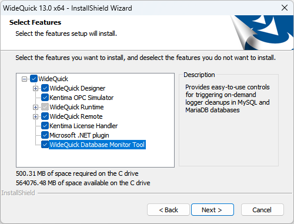{width=400}
  <figcaption>Dialogue for choosing setup type.</figcaption>
</figure>
  
   You may choose between installing: 
     
   - **Kentima OPC Simulator** - will be installed if you selected Function Demo under **WideQuick®** Designer.
   - **WideQuick® License Manager** - is an independent program to license the various **WideQuick®** programs.
   - **WideQuick® Designer** consists of:
      -  Program files which must be installed and cannot be de-selected.
      - Preview programs that are necessary to test projects.
      - A functions demo showing some of the program’s possibilities.
   - **WideQuick® Runtime** consists of:
       - Program files necessary to run a project.
   - **WideQuick® Remote** consists of:
         - Program files necessary to run a project from a remote system.
     
    Choose your program features and click ++"Next >"++.
      
    
  
  
    
      
#### Install **WideQuick®** Runtime
        
   If you have chosen to install **WideQuick® Runtime**, the next dialogue will ask you to enter the product code for Runtime.
          
          
<figure markdown="span">
    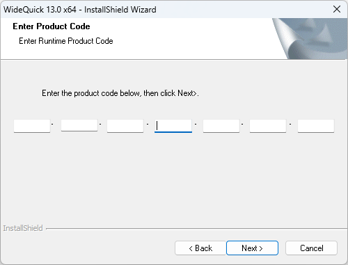{width=400}
  <figcaption>Dialogue for entering the Runtime product code.</figcaption>
</figure>
       
       
   You will find the product code either in the sleeve of the CD, or you will have been notified of it in connection with the download of **WideQuick®**. The product code consists of numbers 0-9 and capital letters A-Z. The entry dialogue automatically converts all letters into capitals.
       
   Enter the product code and click ++"Next >"++ to continue the installation.
     
                 
#### Selecting the installation folder
 
   In the following dialogue you may change the installation folder
   
   
<figure markdown="span">
    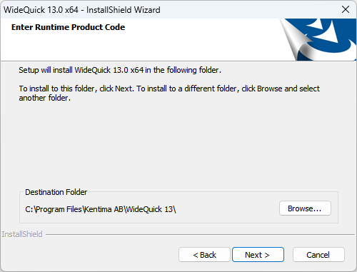{width=400}
  <figcaption>Dialogue for changing installation folder.</figcaption>
</figure>

   You may choose where you would like **WideQuick®** Designer and/or **WideQuick®** Runtime to be installed. To change the installation folder, click ++"Browse…"++ and a new dialogue will appear.

<figure markdown="span">
    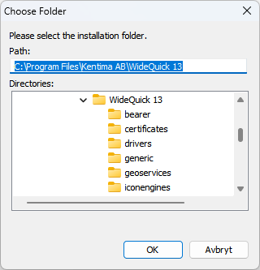{width=400}
  <figcaption>Dialogue for selecting installation folder.</figcaption>
</figure>
   

   Choose your desired installation folder and click ++"OK"++ when you are finished, or ++"Cancel"++ to go back.
   Finally, click ++"Next >"++ to move on to the next dialogue.
      
      
      
#### Installation Summary
Before the installation starts copying files, you will see dialogue displaying the choices you have made and the information you have provided.
       
         
<figure markdown="span">
    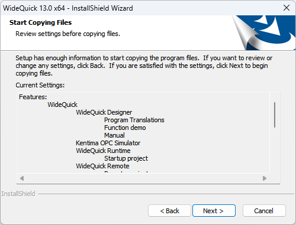{width=400}
  <figcaption>The dialogue for confirming the choices you have made.</figcaption>
</figure>
            

         
       
       
If you are satisfied with your selection, click ++"Next >"++ to start copying the files.
     
                 
 During the installation process you will see a status dialogue.     
         
<figure markdown="span">
    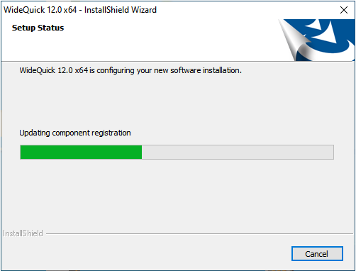{width=400}
  <figcaption>Status during the installation.</figcaption>
</figure>

      
When everything is completed, you will see this dialogue:
 
<figure markdown="span">
    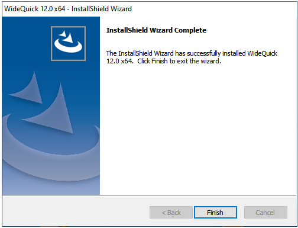{width=400}
  <figcaption>Dialogue which lets you know that everything is completed.</figcaption>
</figure>

         
       
       
Click ++"Finish"++ to finish the installation procedure.

!!! success "WideQuick is now installed"     

    You have now completed the steps to install WideQuick! To launch **WideQuick® Designer** please access your start menu on your device. 

    <figure markdown="span">
        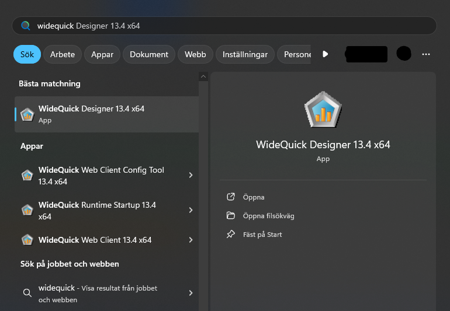{width=400}
    <figcaption>WideQuick® Designer in the start menu.</figcaption>
    </figure>

## Further help  
  
!!! info "Want more information regarding your WideQuick Installation?"

     For more information on how to change the installation, licenses and licensing and more. Please consult the WideQuick Manual accessible from **WideQuick Designer** by pressing ++"F1"++ or by menu **Help>Getting Started**