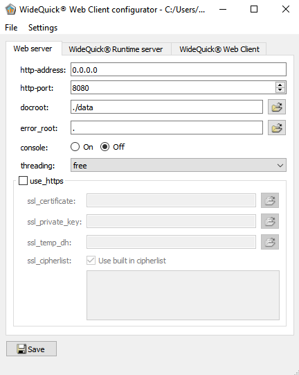
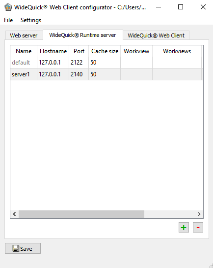
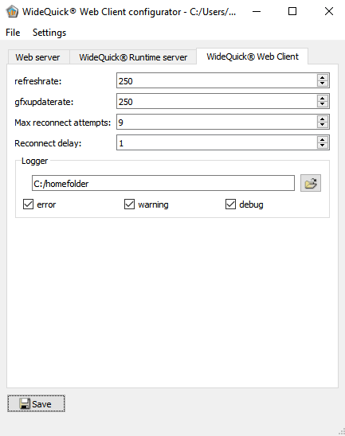
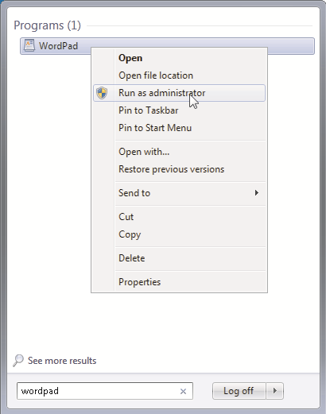

# Install WideQuick Web Client

## Installing WideQuick Web Client

### Configuration of **WideQuick® Web Client** Standalone

#### WideQuick® Web Client Config Tool

Since **WideQuick** version 8 the web client is shipped with a graphical tool for configuring the .ini-file that will be installed alongside the web client. The tool is built in a very self-explanatory way and provides graphical interface for editing all the settings in the .ini-file.



- **File**

  In the File menu you will find commands to create, open and save configurations.

- **New**

  Creates a new configuration to edit

- **Open**

  Open an existing configuration to edit.

- **Save**

  Saves the current configuration.

- **Save as…**

  Allows you to save a new copy of the current configuration.

  !!! Observe

        If the configuration file requires elevated privilege to be saved the program may display a UAC-dialog on saving.

- **Exit**
  Exits the program.
- **Settings**
  - **Store relative paths**

    If this option is checked the program will attempt to convert all paths in the configuration into relative paths, relative to where the configuration file is located.

  - **Restart service**

    Restarts the service **WideQuick Web Client**. The option is only available on Windows system if the loaded configuration is used by the service. After a configuration has been modified and saved, the **WideQuick Web Client** service must be restarted in order for the changes to take effect.

- **Web server**

  The tab Web server contains the initialization values for **WideQuick® Web Client**.
  The information is located in the [web-server] section in the ini-file.
  - **Http-address**

    The IP-address **WideQuick® Web Client** will listen on.
    Default value is _0.0.0.0_ and corresponds to all available IP-addresses on the computer.
    It is possible to specify _127.0.0.1_ or _localhost_, but please note that if you do so, then the server will not be available to other computers on the network.

  - **Http-port**

    Http-port used by **WideQuick® Web Client** for incoming connections.
    If http-port is left empty the default port 80 will be used for http-connections and 443 for https-connections.

  - **Console**

    If console is on, **WideQuick® Web Client** will run with a visible console window for debug purpose.

  - **threading**

    Choose what threading model the web client should use. This setting can be relevant if there are specific performance requirements. free specifies that web client should create as many threads as is deemed necessary, while strict specifies that there should be a fixed amount of threads throughout the entire runtime of the process.

  - **docroot**

    If you want to utilize resources other than those provided with **WideQuick® Web Client** by default, you may alter this path to the directory of your resources.
    By default this is set to ‘./data’

  - **error_root**

    Specifies a directory that contains standard-error pages (.html).
    By default this is set to '.' to display the standard built-in error pages.

    To add a custom error-page, add files with the following names in the specified directory, the files should contain a page specified in html.

    ```{ .txt .no-copy title="error_root catalogue" }
        .
        ├─ 200-ok.html
        │
        ├─ 201-created.html
        │
        ├─ 202-accepted.html
        │
        ├─ 204-nocontent.html
        │
        ├─ 300-multiple-choices.html
        │
        ├─ 301-moved-permanently.html
        │
        ├─ 302-found.html
        │
        ├─ 303-see-other.html
        │
        ├─ 304-not-modified.html
        │
        ├─ 307-moved-temporarily.html
        │
        ├─ 400-bad-request.html
        │
        ├─ 401-unauthorized.html
        │
        ├─ 403-forbidden.html
        │
        ├─ 404-not-found.html
        │
        ├─ 413-request-entity-too-large.html
        │
        ├─ 500-internal-server-error.html
        │
        ├─ 501-not-implemented.html
        │
        ├─ 502-bad-gateway.html
        │
        ├─ 503-service-unavailable.html
        │
        └─

    ```

    For a specification on what the various error-codes mean, see:

    [www.w3schools.com/tags/ref_httpmessages](http://www.w3schools.com/tags/ref_httpmessages.asp){:target="\_blank"}

  - **use_https**

    When use_https is set to true the web server will use HTTPS (Hypertext Transfer Protocol Secure), when establishing connections and communicating with clients, such as a web-browser.

    !!! Note

          If use_https is selected the values; ssl_certificate, ssl_private_key and ssl_temp_dh must be specified, otherwise the server cannot start.

- **ssl_certificate**
  Specifies the SSL-certificate to be used by secure communication.
  This is only required if use_https is selected.
- **ssl_private_key**
  Specifies the private server key used by secure communication.
  This is only required if use_https is selected.
- **ssl_temp_dh**
  Specifies the random Diffie-Hellman parameters used for secure key exchange.
  This is only required if use_https is selected.

#### WideQuick® Runtime Server

The tab **WideQuick® Runtime Server** contains information regarding instances of **WideQuick® Runtime** that **WideQuick® Web Client** can connect to and what workviews and variables is possible to specify in the URL.

The information is located in the `[wqre-server]` section in the ini-file.



- **Name**

  The name of the server. The name can be used as an argument in the URL **WideQuick® Web Client**.
  Example URL: localhost/?wqruntime=server1, this URL would connect to a webserver running on localhost on port 80, and the webserver would in turn connect to a **WideQuick** server located on localhost at port 2140, as specified by server1 in the image above.
  All servers that are not the default will be stored under its own node [name] in the ini-file.

- **Hostname**

  IP-address of the computer executing **WideQuick® Runtime**.
  The IP-address 127.0.0.1 means that** WideQuick® Runtim**e and **WideQuick® Web Client** are running on the same system.

- **Port**

  The connection port specified for view access in the **WideQuick®** project properties.

- **Cache size**

  Specifies the size of the file cache in MB. Specify 0 to completely deactivate the cache.

- **Workview**

  This value should be set to the name of the workview that should be displayed in** WideQuick® Web Client** when connecting to the **WideQuick®** project using a web browser.
  By default this option is left empty to use the startview specified in the WideQuick® Runtime project.

- **Workviews**

  List of workviews that can be used as arguments in the URL to **WideQuick® Web Client**.
  Example URL: localhost/?view=Workview2.kvie, this URL would connect to a webserver running on localhost on port 80, and would start by displaying the workview named Workview2.kvie.
  The information is saved as view_args in the ini-file and must be separated with a space.

- **Export variables**

  List of variables that will be exposed and accessible through the URL to **WideQuick® Web Clien**t.
  Example URL: localhost/?export_var1=11&export_var2=22, this URL would connect to a webserver running on localhost on port 80, and would assign the exported variables exported_var1 to 11 and exported variable exported_var2 to 22.
  The information is saved as export_vars in the ini-file and must be separated with a space.

#### WideQuick® Web Client

The tab **WideQuick® Web Client** configures how frequently **WideQuick® Web Client** should update the GUI for the project and how frequently data should be synchronized with **WideQuick® Runtime**.
The information is located in the [wqweb] section in the ini-file.



- **refreshrate**

  Frequency of WideQuick® Web Clients synchronisation of data with WideQuick® Runtime.

- **gfxupdaterate**

  Frequency of WideQuick® Web Client update rate of the graphical interface to web browsers.

- **Max reconnect attempts**

  Specifies the maximum amount of reconnect attempts that the remote system should attempt. If the value is set to 0, then no reconnect attempts will be performed.

  If the value is set to -1 then the remote system will attempt to reconnect indefinitely.

- **Reconnect delay**

  Specifies how many seconds the remote system should wait in between reconnect attempts.

- **Logger**

  The section Logger provides the path to the directory where the logging information is stored, as well as configuring what level of logging that should be active.

  The information is located in the **[logger]** section in the ini-file.

- **File path**

  Specify the path to the folder where the logging information should be stored. WideQuick® Web Client requires write access to the folder.

- **Error, warning and debug**

  Select if Error, warning and/or debug information should be logged in the logging file or not.

#### Configuring the .ini-file manually

The ini-file can also be edited manually. Open Notepad, Notepad++ or equivalent and make sure it has administrative rights.

As an example you can start WordPad as an administrator by writing WordPad in the start menu and then right-click on the program.

Finally select Run as administrator.



Open wqweb.ini, which by default is available in the following directories:

- Default (for 64-bit Windows) : C:\Program Files (x86)\Kentima AB\WideQuick Web Client
- Default (for debian installations) : /etc/wqweb/

Following the installation, the content should look as displayed below:

```{.íni title="wqweb.ini"}
   [web-server]
   http-address=127.0.0.1
   http-port=80
   docroot=.
   error_root=.
   console=true
   use_https=false
   ssl_certificate=cert.pem
   ssl_private_key=server.key
   ssl_temp_dh=dh2048.pem
   [wqre-server]
   hostname=127.0.0.1
   port=2122
   workview=
   view_args=
   export_vars=
   [wqweb]
   refreshrate=250
   gfxupdaterate=250
   [logger]
   filepath=C:/ProgramData/Kentima AB/WQWebClient/Log
   error=true
   warning=true
   debug=true
```

### Configuration of the WideQuick® Project

For WideQuick® Web Client to connect to a WideQuick® Runtime project the WideQuick® Runtime project must be configured in the same way as when it is used together with WideQuick® Remote Client.

#### View Access

The WideQuick® Runtime project must have an active port for view access. The view access port specifies the TCP/IP port for communication between two instances of WideQuick® Runtime or between WideQuick® Runtime and WideQuick® Web Client.

The view access port is specified in the project properties, for e.g. port 2122

#### Read and Write access to DataStore Variables

For all variables and alarms which values should be transmitted to the client or back, the View access must be set to Read and/or Write as desired.

#### Start View

Any view in a project can be set as the Start View of the Web Client independent of the Start View for **WideQuick Runtime**. All other windows in the project are sub views to the main view. Sub views are automatically closed when their parent is closed.

When the main view is closed, all other windows will also be closed, and your presentation will be terminated.

If you link to another workview from the start view, and that workview is opened in the same window as the start view, it will resume the role of main view.

To set a Start View for the Web Client. Right click any view and set the view as Start View for _WQWeb_

### Connect with Web Browser

When WideQuick® Web Client, the WideQuick® Runtime project and the web server are configured it is possible to display the WideQuick® Runtime project in any web browser without the need to install any extra plug-in components to the browser.

The URL for an IIS server configured as described above is:

```
http://ServerName:ConnectionPort
```

Where Server Name is the web server’s IP address or computer name or full URL to the web server.

### Supported Properties

- **Variables and Data Types**

  All types of variables are supported by WideQuick® Web Client.

- **Dynamics**

  All forms of dynamics are supported by WideQuick® Web Client. However, dynamics is not supported in a few properties. See Dynamics for more information on where dynamics is not supported.

- **Workviews**

  When connecting to a WideQuick® Web Client the view specified in the configuration file is displayed. Thereafter navigation is possible through the link() function or a multiviewer.

- **Objects**

      The following objects are supported for the most part in WideQuick® Web Client. Some functionality may be missing. See Objects for more information about functionality missing.

   <div style="display: flex; flex-wrap: wrap;">
    <div style="flex: 1; min-width: 200px;">
      <ul>
        <li>Alarm – Blocking list</li>
        <li>Alarm – Frequency list</li>
        <li>Alarm – List</li>
        <li>Alarm – Log</li>
        <li>Alarm – Row</li>
        <li>Combo box (Not editable)</li>
        <li>Button – temporary (Does not display unique text when clicked)</li>
        <li>Box</li>
        <li>Arch</li>
        <li>Check box</li>
        <li>Custom Button</li>
      </ul>
    </div>
    <div style="flex: 1; min-width: 200px;">
      <ul>
        <li>Custom Spin box</li>
        <li>Datetime Edit</li>
        <li>Ellipse</li>
        <li>EthirisView</li>
        <li>History</li>
        <li>History2</li>
        <li>Image</li>
        <li>Line</li>
        <li>Line Chart 2</li>
        <li>Map View</li>
        <li>Multiviewer</li>
        <li>Object list</li>
        <li>Polygon</li>
      </ul>
    </div>
    <div style="flex: 1; min-width: 200px;">
      <ul>  
        <li>Radio button</li>
        <li>Slider</li>
        <li>Spin box</li>
        <li>Trend</li>
        <li>Triangle</li>
        <li>Table</li>
        <li>HTML</li>
        <li>Report view</li>
        <li>Bar Chart 2</li>
        <li>Event List 2</li>
        <li>Text</li>
        <li>Text box</li>
        <li>Tree view</li>
      </ul>
    </div>
  </div>

- **Groups and Instances**  
   WideQuick® Web Client has full support for groups and instances.

- **Data Base Connections**

  WideQuick® Web Client supports the use of virtual databases.

- **Remote System**

  WideQuick ® Web Client supports that information is retrieved from multiple remote systems. I.e. if the WideQuick® Runtime that the web client connects to in turn receives information from other Runtime systems, then that information will also be presented in the browser.

  WideQuick® Web Client also supports remote-systems through the linkRemote() functionality, and the configuration for remote systems in the multiviewer.

- **Users and Privileges**

  WideQuick® Web Client supports that users log in and out, change passwords and edit users via script and dialogs.

- **Language**

  WideQuick® Web Client supports translation of both project and application.

- **Script**

  Most features are supported via script. However, there are some exceptions. See Script for more information.

- **EthirisView**

  WideQuick® Web Client has full support for EthirisView.

- **History Object**

  Most The history object can be used as an advanced analytical tool to study individual signals, or their interrelationships. The signals which are presented are gathered from one or several loggers. For each signal you can indicate a unique label and color. For the analogue signals, you may also indicate min and max values for the scale, or make them dynamic. The analogue signals are presented as curves, and the digital signals as lines.

- **Mail**

  It is possible to use the mail system in WideQuick® Web Client. The mails will be sent from the server that Web Client is connected to.

### Not Supported Properties

- **Dynamics**

  The following properties of dynamics are not supported:
  - Bring workviews to front.

- **Workviews**

  When connecting to a WideQuick® Web Client the view specified in the configuration file is displayed.

  WideQuick® Web Client does not present any menus in workviews.

- **Objects**

  Some shared properties are not supported by WideQuick® Web Client for any object.
  - Other borders than solid and no border.
  - Font does not support strikethrough and underline.
  - If the browser does not have access to the specified font, it chooses a similar font.

  The following objects are not supported via WideQuick® Web Client.
  - ActiveX
  - Bar Chart
  - Camera
  - Combo box (Editable)
  - Event list
  - Gauge
  - Knob
  - Line Chart
  - Tab

    Tab indexes for object navigation is not supported.

    !!! Note

        If a font is unavailable in the browser, a similar font will be used. However, to ensure that the project looks as similar as possible, only fonts with good web support should be chosen if the project is intended to be used with WideQuick Web Client.

- **Unit System**

  WideQuick® Web Client does not support unit conversions.

- **Script**

  The following features are not supported by WideQuick® Web Client:
  - **Bitmap object** – The following
  - print()
  - **COMObject object**
  - **Debugger object**
  - **File object**
  - **Run external application**
  - **Messenger object**
  - **Process object**
  - **SerialPort object**
  - **UnitSystemCollection object**
  - **Workview object** – The following
    - grab()
    - print()
    - translate()
    - mapTo()
    - mapFrom()
    - mapToScreen()
    - mapFromScreen()

